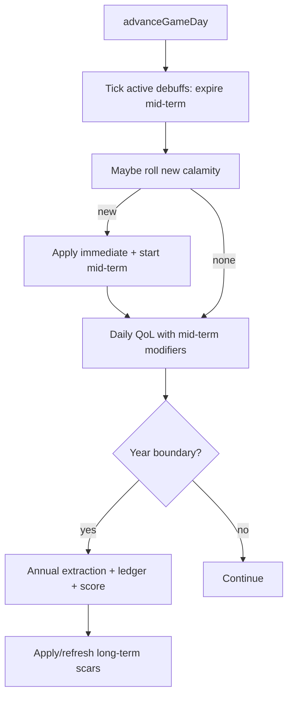

# Calamities: Design Recommendation (Revised)

## Verdict

**Yes — and your framing is better than the first pass.** Treat calamities as a normal part of island life (fires, quakes, storms, disease), not once-per-reign black swans. Each one is a **visible nation debuff** with a clock, plus lasting scars after the banner goes away.

## Design stance (updated)

| Earlier draft | Revised |
| --- | --- |
| Rare (few per long reign) | **Moderate frequency** — several per year is fine; overlapping debuffs expected |
| One-shot year-boundary shock | **Phased consequences**: immediate → mid-term → long-term |
| Mostly annual bookkeeping | **Day-duration active debuffs** (calendar is 364 days/year) + annual scars |
| Silent resource tweak | **UI-first**: named debuff chip/banner with remaining days |

Still true: do **not** subtract “timber −2 score points” directly. Score moves via resource sufficiency, environment, QoL, migration — same composite in [`computeNationScore`](packages/simulation/src/progression/nation-score.ts).

## Core concept: Active Calamity Debuff

A calamity is an instance of:

```typescript
// Conceptual shape — not implemented yet
ActiveCalamityDebuff {
  id: string;              // instance id
  calamityId: string;      // catalog key, e.g. "forest_fire"
  name: string;
  regionIds: RegionId[];   // often 1; storms/disease may fan out
  startedOnGameDay: number;
  endsOnGameDay: number;   // when the visible mid-term debuff expires
  severity: "minor" | "moderate" | "severe";
  phases: {
    immediate: AppliedEffects;   // applied on onset
    midTerm: OngoingModifiers;   // while active (until endsOnGameDay)
    longTerm: LingeringEffects;  // may outlive the banner
  };
}
```

**Player-facing rule:** while `gameDay < endsOnGameDay`, show the debuff (name, regions, severity, days remaining). When the timer ends, the banner clears but long-term scars can remain (damaged reserves, lower env, degraded terrain).

## Three consequence phases


### 1. Immediate (onset day / same annual cycle)

One-time damage the player feels right away:

- Destroy or cut regional resource capacity/reserves (timber burn-off, flooded cropland)
- Spike environment quality down in hit regions
- Optional terrain degradation (forest → cleared) for severe fires/quakes
- Optional short mortality / emigration bump for disease / tsunami (tune carefully so it does not auto-lose)

### 2. Mid-term (active debuff window, measured in **days**)

Ongoing modifiers while the chip is visible — this is the “debuff on the nation”:

- Extraction / production efficiency penalty in affected regions or sub-sectors
- Happiness / QoL drag for people in those regions (or nation-wide for disease)
- Higher shortfall risk feeding industrial unhappiness via the ledger
- Duration examples (tunable in `GameSettings`):
  - Accidental fire / tornado: **14–45 days**
  - Forest fire / hurricane: **60–120 days**
  - Earthquake recovery / tsunami: **90–180 days**
  - Disease outbreak: **120–280 days**

Multiple active debuffs can stack (capped, e.g. max 3–5 concurrent) with diminishing or additive rules defined in settings.

### 3. Long-term (after banner clears)

Scars that persist into later years without a UI timer (or with a much longer, quieter recovery):

- Permanently lower (or slowly regenerating) `reserveOrCapacityByResource`
- Depressed `environmentQuality` that recovers via existing env recovery
- Terrain left degraded until natural/player-driven recovery paths catch up
- Optional multi-year “recovery” flag for severe events (no loud banner; shows in Records / region detail)

This matches how the world already works: over-extraction already scars tiles; calamities are the random cousin of that pressure.

## Frequency (not rare, not constant)

Target feel: **common enough that a 10-year reign sees a handful of memorable hits**, with quiet stretches between.

Suggested tuning defaults (all in `GameSettings.calamities`):

- Base chance to roll **once per game day** is too noisy; prefer **weekly or monthly checks**, or **1–3 rolls per year** with weighted severity
- Practical default: **~0.5–1.5 calamities per year** on average at normal difficulty, skewed toward minor/moderate
- Severe events rarer within the catalog weights
- Soft cooldown after a severe hit (e.g. 60–90 days) so the UI is not a permanent red banner wall
- Region filters prevent nonsense (tsunami only coastal; forest fire needs forest/timber; tornado inland plains/farm, etc.)

## Catalog

Mapped to real sim surfaces: biomes (`plains`, `forest`, `mountains`, `desert`, coastal flag), seven resources (`crops`, `livestock`, `timber`, `fish`, `metalOre`, `fossilFuels`, `stone`), and non-extractive sectors (industrial / services / QoL).

**v1 ship set** = common + clearly regional. **v1.5 / v2** = industrial accidents, social unrest, rarer compound events.

### Natural — weather & climate

| Id | Targets | Immediate | Mid-term | Long-term | Tier |
| --- | --- | --- | --- | --- | --- |
| `forest_fire` | Forest / timber | Burn timber, env drop | Forestry + local QoL ~90d | Slow timber regen / cleared terrain | v1 |
| `wildfire_smoke` | Adjacent to fire regions | Mild env / happiness hit | Broad light QoL drag ~45d | None | v1.5 |
| `drought` | Plains / farm / freshwater overlay | Crop + water stress | Agri/livestock efficiency ~120d | Multi-year water stress if severe | v1 |
| `heatwave` | Plains / desert / settled | Happiness spike down | Labor efficiency nation-light ~30d | None | v1 |
| `flood` | Plains / coastal lowlands | Crop/livestock capacity cut, env | Agri + transport drag ~90d | Env scar | v1 |
| `flash_flood` | Mountains runoff → plains | Localized crop/stone hit | Short regional drag ~21d | Small | v1.5 |
| `hurricane` | Coastal / multi-region | Broad env + multi-resource dip | Multi-region drag ~90d | Mild env debt | v1 |
| `tropical_storm` | Coastal | Lighter than hurricane | Fishing/coastal ~45d | Minimal | v1 |
| `tornado` | Inland plains / farm | Localized crop/structure hit | Short regional ~30d | Small | v1 |
| `blizzard` | Mountains / high elevation | Temporary labor halt flavor | Mining/quarry/transport ~21d | None | v1.5 |
| `hailstorm` | Plains / crops | Crop capacity smash | Agri ~45d | None | v1.5 |
| `landslide` | Mountains / forest slopes | Stone/timber/ore access cut | Mining/forestry/quarry ~60d | Possible terrain damage | v1 |
| `volcanic_ash` | Near mountains (if volcanic flavor) | Crop yield smash, env | Agri + air/transport ~120d | Soil mix: short pain, long mild fertility bump optional | v2 |

### Natural — geological & marine

| Id | Targets | Immediate | Mid-term | Long-term | Tier |
| --- | --- | --- | --- | --- | --- |
| `earthquake` | Any; worse mountains/mines | Reserve loss, env | Mining/quarry/construction ~120d | Terrain damage possible | v1 |
| `aftershock_cluster` | Follows severe earthquake | Smaller repeat hits | Extends quake debuff | Stacks scar | v1.5 |
| `tsunami` | Coastal | Coastal reserves + env smash | Fishing/coastal production + QoL ~150d | Strong env scar | v1 |
| `coastal_erosion` | Coastal | Slow capacity nibbles | Mild fishing/quarry ~180d | Permanent coastal capacity trim | v2 |
| `sinkhole` | Mining / quarrying regions | Local ore/stone access loss | Mining/quarry ~60d | Reserve permanently reduced | v1.5 |
| `mine_collapse` | Metal ore / energy regions | Workers + reserve shock | Mining/energy efficiency ~150d | Finite reserve loss | v1 |
| `well_blowout` | Fossil fuel regions | Env smash, fuel reserve hit | Energy + heavy env drag ~120d | Strong env scar | v1 |

### Natural — biological

| Id | Targets | Immediate | Mid-term | Long-term | Tier |
| --- | --- | --- | --- | --- | --- |
| `disease` | Population (region → can spread) | Mortality / emigration bump | Nation or regional QoL + labor ~180d | Fertility/migration hangover optional | v1 |
| `livestock_plague` | Livestock regions | Livestock capacity crash | Livestock + food-processing ~150d | Slow herd recovery | v1 |
| `crop_blight` | Agriculture / plains | Crop capacity crash | Agri + food-processing ~120d | Seed/soil recovery debt | v1 |
| `fishery_collapse` | Coastal fishing | Fish capacity crash | Fishing ~180d | Slow fish regen | v1 |
| `insect_swarm` | Plains / crops | Crop hit | Agri ~60d | None | v1.5 |
| `invasive_species` | Forest / coastal / farm | Mild capacity drain | Extractive efficiency ~200d | Persistent mild regen penalty | v2 |
| `red_tide` | Coastal | Fish capacity + env | Fishing ~90d | Mild coastal env | v1.5 |

### Human / accidental

| Id | Targets | Immediate | Mid-term | Long-term | Tier |
| --- | --- | --- | --- | --- | --- |
| `accidental_fire` | Settled / industrial presence | Small capacity / happiness hit | Local QoL ~21d | Minimal | v1 |
| `factory_fire` | Industrial regions | Light-manufacturing / food-processing hit | Industrial efficiency ~60d | None | v1 |
| `warehouse_fire` | Trade hubs / any settled | Shortfall spike (goods lost) | Wholesale-retail / logistics ~30d | None | v1.5 |
| `oil_spill` | Coastal + energy | Fish + coastal env smash | Fishing + env ~200d | Long coastal scar | v1 |
| `chemical_spill` | Industrial / heavy-industry | Env + local happiness crash | Industrial + local QoL ~120d | Env scar | v1.5 |
| `dam_failure` | Freshwater overlay / plains below | Flood-like smash downstream | Agri + utilities ~150d | Water overlay damage | v2 |
| `power_outage` | Utilities-linked / nation-light | Happiness dip | Industrial + services efficiency ~14–45d | None | v1.5 |
| `bridge_collapse` | Transport / logistics flavor | None to stocks | Transport-logistics + regional trade drag ~90d | None | v2 |
| `mining_accident` | Mining regions | Small mortality + output halt | Mining ~45d | None | v1 |
| `overfishing_scandal` | Trigger bias if fish already over-extracted | Reputation / emigration tick | Fishing forced throttle ~90d | Mild | v2 |

### Social / political (optional later — still “calamities” to the monarch)

| Id | Targets | Immediate | Mid-term | Long-term | Tier |
| --- | --- | --- | --- | --- | --- |
| `labor_strike` | One sub-sector (weighted to unhappy) | Output halt in sector | Sector efficiency ~30–60d | None | v2 |
| `food_riot` | Low QoL / crop shortfall bias | Happiness crash, emigration | Nation QoL ~45d | None | v2 |
| `bank_panic` | Financial services | Happiness / investment flavor | Services drag ~60d | None | v2 |
| `plague_of_corruption` | Government / admin flavor | Mild nation efficiency | Broad light drag ~120d | None | v2 |

### Compound / cascading (spawn rules, not always standalone rolls)

| Trigger | May cascade into |
| --- | --- |
| Severe `earthquake` | `aftershock_cluster`, `tsunami` (if coastal), `mine_collapse` |
| `forest_fire` | `wildfire_smoke`, `accidental_fire` in adjacent settled |
| `drought` | `crop_blight`, `livestock_plague`, `heatwave` |
| `hurricane` | `flood`, `oil_spill` if energy coastal |
| `well_blowout` | `oil_spill` if coastal |
| Sustained resource famine | `food_riot` (v2) |

### Design notes for the expanded list

- Prefer calamities that touch **one clear resource or sector** so the debuff strip stays readable (“Fishery Collapse — coastal R12 — 112 days”).
- Human accidents should be **more common but shorter**; geological/marine **less common but deeper scars**.
- Bias weights with world state later (optional): over-extracted timber → higher `forest_fire`; low env → higher disease; coastal energy → `oil_spill` / `well_blowout`.
- v1 implementation catalog (concrete ship list): `forest_fire`, `accidental_fire`, `earthquake`, `tsunami`, `hurricane`, `tropical_storm`, `tornado`, `flood`, `drought`, `heatwave`, `landslide`, `disease`, `crop_blight`, `livestock_plague`, `fishery_collapse`, `mine_collapse`, `well_blowout`, `oil_spill`, `factory_fire`, `mining_accident`.

Weights and severity bands live in `packages/data`; simulation only applies effects.

## Where it lives in the loop

Calendar today: `daysPerYear: 364` in [`game-settings.ts`](packages/data/src/config/game-settings.ts). Day advance is already the heartbeat ([`advanceGameDay`](packages/web/src/game/population-cycle.ts)).



- **Onset + mid-term modifiers:** day loop (so duration-in-days is honest)
- **Resource destruction / terrain scars:** apply at onset; annual extraction naturally reflects damaged capacity
- **Score:** still yearly; a mid-year fire shows as a worse year-end score, not a fake daily score flash
- **UI:** update every day advance so “47 days remaining” counts down

## UI: nation debuff presentation

Show active calamities as a **persistent status strip** (AppShell or Score area), not only a one-shot toast:

- Icon + name + severity
- Affected region name(s)
- **Days remaining** (and optionally phase label: “Recovery underway”)
- Click → short detail (what is debuffed: e.g. “Forestry output −25% in North Ridge”)

Also:

- Onset toast / modal for moderate+ severity
- Map pulse / tint on affected regions while active
- Year log + Records history entry when it starts and when mid-term ends
- Long-term scars visible in region/resource panels, not as forever-red nation chips

## Effect channels (still reuse existing sim)

| Channel | Lever | Phase |
| --- | --- | --- |
| Resource stock/capacity | `RegionResourceState.reserveOrCapacityByResource` | Immediate + long-term |
| Environment | `environmentQuality` | Immediate + long-term recovery |
| Terrain | existing degradation path | Immediate (severe) |
| Ongoing production | mid-term efficiency multipliers in extraction / happiness | Mid-term |
| Population pressure | disease mortality / emigration modifiers | Immediate + mid-term |
| Nation score | indirect via sufficiency / env / QoL | Year end |

## Design constraints

1. **Readable stacking** — if 3 debuffs are up, the strip must stay scannable; cap concurrency.
2. **Fairness** — mid-term always expires; long-term recovers via existing regen/env systems so the player is not permanently soft-locked without agency.
3. **Agency gap acknowledged** — v1 relies on time + diversification (economic systems) + natural recovery; later: stockpiles, relief spending, labor moves.
4. **Deterministic rolls** — seed from world/run seed + gameDay.
5. **Win/lose** — debuffs pressure streaks; only disease/tsunami severe bands should meaningfully touch mortality, and never as an instant extinction button.
6. **No direct industry score points** — debuff copy can say “Forestry strained” but the number that moves is the nation composite.

## Suggested build scope (when implementing)

1. Catalog + `GameSettings.calamities` (frequency, cooldowns, duration bands, stack cap, severity weights).
2. Persistence: `activeCalamities[]` + `calamityHistory[]` on `GameRunState`.
3. Simulation: `rollCalamity`, `applyImmediate`, `getMidTermModifiers`, `tickCalamityDebuffs`.
4. Wire into `advanceGameDay` (tick/roll/modifiers) and annual cycle (extraction sees damaged state).
5. UI: nation debuff strip with days remaining, onset notice, map highlight, Records log.
6. Tests: targeting filters, phase timing, expiry, stacking cap, seeded rolls.

## Bottom line

Your instinct is right: calamities should feel like **weather and misfortune on an island**, not legendary once-offs. Model them as **day-timed nation debuffs** with a loud mid-term phase and quieter long-term scars, moderately frequent, stack-limited, and scored only through the economy you already simulate.
