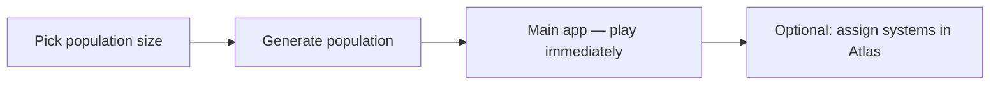
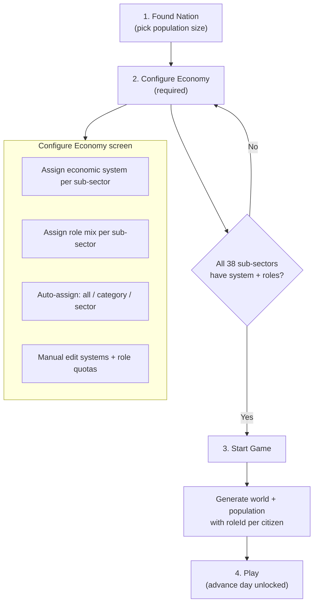
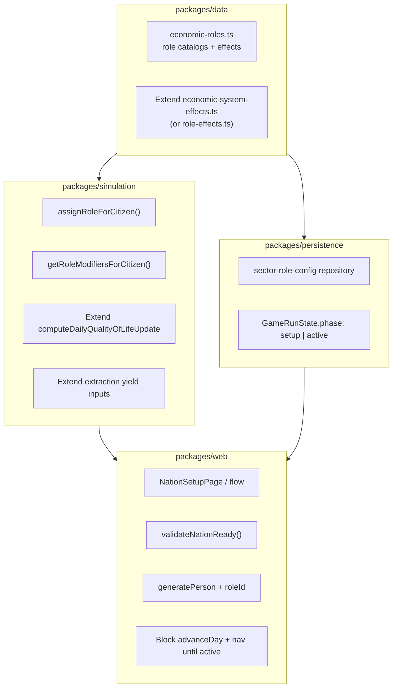
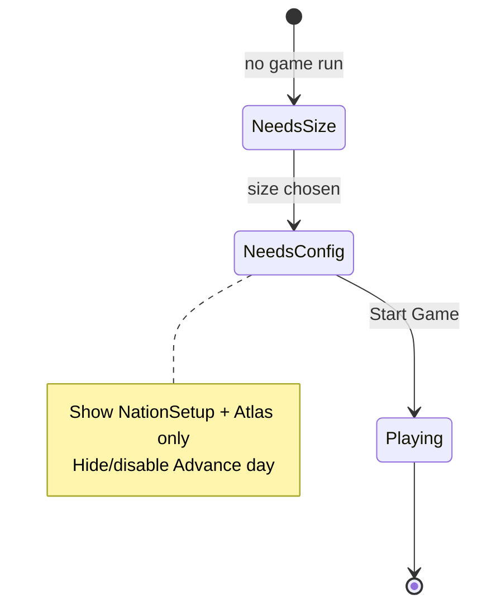
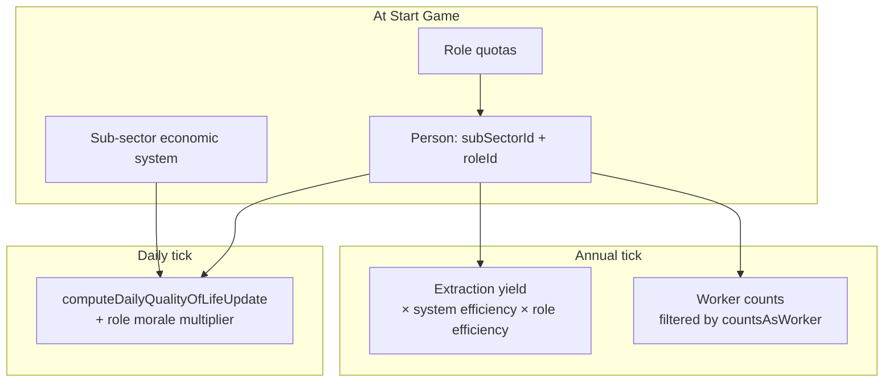

# Economic Roles Pre-Start Setup

## Summary

This is a **setup-gated nation founding** feature. Today the game jumps from population size → immediate generation → playable sim, with optional per-sub-sector economic systems assigned anytime in the Atlas. The new model adds a mandatory **Configure Nation** phase where the monarch assigns every sub-sector's economic system **and** role structure, then explicitly presses **Start Game** to generate citizens with `roleId` and unlock the simulation.

---

## Current state (baseline)

| Area | Today |
| --- | --- |
| New-game flow | `NewGameSetupPage` → `startGeneration()` → population on disk → main app |
| Economic systems | 11 systems in `packages/data`; optional per sub-sector in `sector-assignments` |
| Person model | `categoryId` + `subSectorId` (industry); no social/economic **role** |
| Effects | Sector-level `efficiencyMultiplier`, `moraleMultiplier`, `environmentalImpactMultiplier` |
| Sub-sectors | **38** total (`getAllSubSectorEmploymentShares().length`) |
| Game loop gate | Only `gameRun.status !== "active"` blocks day advance |



---

## Target player flow



**Principles**

- No population generation and no `advanceDay` until **Start Game**.
- World/region generation can happen at step 1 or 2 (cheap relative to 1M citizens); population waits until Start.
- Atlas remains the place to **edit** assignments during setup; a dedicated **Nation Setup** hub shows completion status and the Start button.

---

## Domain model

### 1. Economic system (unchanged concept, stricter enforcement)

Still one `EconomicSystemId` per `(categoryId, subSectorId)` — stored in existing `sector-assignments`.

### 2. Roles (new)

Each economic system defines a **role catalog** with stable numeric IDs.

**ID scheme** (example — finalize in research doc):

| System | ID range | Example roles |
| --- | --- | --- |
| Capitalism | 10–19 | worker (10), manager (11), owner (12), entrepreneur (13) |
| Socialism | 20–29 | collective worker (20), planner (21), party cadre (22) |
| Feudalism | 60–69 | knight (66), **serf (65)**, lord (67), clergy (68) |
| … | per system | 3–6 roles each |

```typescript
// packages/data — illustrative
interface EconomicRole {
  id: number;                    // e.g. 65
  systemId: EconomicSystemId;
  slug: string;                  // "serf"
  label: string;
  description: string;
  /** Who can hold this role */
  eligibility: "working-age" | "any-age" | "non-working";
}

interface RoleEffect {
  roleId: number;
  /** Multiplies worker extraction output (1 = baseline) */
  efficiencyMultiplier: number;
  /** Daily happiness delta modifier */
  moraleMultiplier: number;
  /** Optional override weekly hours; undefined = use sub-sector default */
  weeklyHoursOverride?: number;
  /** Whether this role counts as a "worker" for extraction tallies */
  countsAsWorker: boolean;
}
```

### 3. Role distribution (per sub-sector, not per person at setup time)

For 10k–1M citizens, setup stores **quotas**, not individual picks:

```typescript
// Per sub-sector key: `${categoryId}/${subSectorId}`
type RoleQuota = { roleId: number; share: number }; // shares sum to 1.0

type SectorRoleConfig = {
  quotas: RoleQuota[];
  /** optional: "custom" | "auto" provenance for UI */
};
```

At **Start Game**, `assignRoleForPerson(subSectorConfig, random)` picks a `roleId` for each working-age citizen in that sub-sector. Non-working-age citizens get `roleId: null` or a system-specific dependent role (research decision — recommend `null` for v1).

### 4. Person schema change

Add to `PersonSnapshot` / `Person`:

```typescript
roleId?: number;  // references EconomicRole.id
```

Persisted in existing cohort chunks; included in directory entries and dashboards where useful.

---

## Package boundaries



Follows constitution principle 4: **pure engine, impure shell**.

---

## Simulation integration

### Daily QoL (`updatePersonStats` → `computeDailyQualityOfLifeUpdate`)

Add optional inputs:

- `roleMoraleMultiplier` (from `getRoleEffect(roleId)`)
- Optionally `roleWeeklyHours` override

Stacking rule (document in research):

`effectiveMorale = systemMorale × roleMorale` (multiplicative, same pattern as today's system morale).

### Annual extraction (`resource-extraction.ts` / `population-cycle.ts`)

When tallying `extractiveWorkersByRegionAndSubSector` / `industrialWorkersBySubSector`:

- Only count citizens where `getRoleEffect(roleId).countsAsWorker === true`
- Multiply per-worker yield by `roleEfficiencyMultiplier × systemEfficiencyMultiplier`

Example feudalism: serfs `countsAsWorker: true`, high labor efficiency, low morale; lords `countsAsWorker: false`, high morale, no direct extraction.

### Annual employment sync

`syncEmploymentWithAge` should **preserve or re-roll `roleId`** when citizens enter working age, using that sub-sector's current quotas (quotas are frozen at Start for v1; changing mid-game is out of scope unless you want a later "reform" feature).

---

## Persistence & game state gating

### Extend `GameRunState`

```typescript
phase: "setup" | "active";   // new field, default "setup"
```

- `createInitialGameRunState` → `phase: "setup"`
- `startGame()` → validate → generate population → `phase: "active"`, `startedAt` updated
- `advanceDay` / calamities / scoring only when `phase === "active"`

### New store: `sector-role-config`

Mirror `sector-assignments` pattern:

- Key: `sector-role-config`
- Value: `Record<string, SectorRoleConfig>`

### Reset behavior

`startNewNation()` / `resetNationStores()` clears sector assignments **and** role config, sets `phase: "setup"`.

### Save migration

Existing saves with population but no `roleId`:

- On load, if `phase` missing and population exists → treat as legacy; either force `needsConfiguration` or one-time auto-backfill with default quotas (recommend **force re-setup** for correctness).

---

## UI / UX plan

### A. Refactor `NewGameSetupPage`

- **Begin** → only saves chosen size + creates `GameRunState(phase: "setup")` + generates **world** (regions/resources), **not** population.
- Navigate to **Nation Setup** (new route `/setup`).

### B. New `NationSetupPage` (hub)

- Progress header: `12 / 38 sub-sectors configured`
- Checklist by category (Extractive, Industrial, …)
- Actions:
  - **Auto-assign all** — assigns recommended default system + default role mix for every sub-sector (see research table)
  - **Start Game** — disabled until `validateNationReady()` passes; shows inline errors ("Industrial / Heavy Industry: missing role quotas")
- Links into Atlas for detailed editing

### C. Extend Atlas (`SectorMap` / `SectorDetail`)

For each sub-sector panel:

1. Economic system dropdown (required; no "Unassigned" once in setup phase)
2. **Role mix** editor when system selected:
   - List roles for that system with % sliders or numeric inputs
   - **Auto-assign roles** button (sector-level)
   - Running total must equal 100%
3. Category-level **Auto-assign** button in `AtlasCategoriesPage` header

### D. App routing gates (`App.tsx`)



- `needsSetup` → size picker
- `needsConfiguration` → setup shell (limited nav)
- else → full `AppShell`

### E. Population page

- Hide or disable **Advance day** until `phase === "active"`
- After start, show "Game day 0" with cohort info as today

---

## Auto-assign design

### Global "Auto-assign all"

For each of 38 sub-sectors:

1. Pick `EconomicSystemId` from a **default mapping table** in `packages/data` (research-backed starting point, e.g. extractive → subsistence or feudalism for agrarian sectors — tunable).
2. Apply that system's **canonical default role mix** (e.g. feudalism: 85% serf, 10% knight, 5% lord).

### Per-category / per-sector auto-assign

Same logic, scoped to selection.

### Default role mixes

Stored in `packages/data` as `defaultRoleQuotasBySystem: Record<EconomicSystemId, RoleQuota[]>`.

---

## Research & documentation deliverables

### New: `research/economic-roles.md`

For **each of 11 economic systems**:

- Historical role definitions (cite `packages/web/public/economic-systems.md` + external sources where applicable)
- Role catalog table (id, label, who holds it)
- Default quota mix with rationale
- Effect multipliers with design justification (v1 balancing, same spirit as `economic-system-effects.ts`)
- Mermaid: role → QoL / extraction paths

### Update: `research/index.md`

Add row linking to `economic-roles.md`.

### Update: `research/resources-and-geography.md`

Note that extraction efficiency is now `base × reserve × system × **role**`.

### Update: `constitution/_intent.md`

- Monarch must configure economy before sim starts
- Citizens have `roleId` in addition to sector employment

### Update: `packages/web/src/pages/InstructionsPage.tsx`

Replace "advance day immediately" with setup → configure → start flow.

### Update: `packages/web/public/economic-systems.md`

Add **Simulation Roles** subsection per system cross-linking to research.

### Mermaid diagrams to include in research doc

**Role effect pipeline:**



---

## Testing plan

### `packages/data`

- Every `EconomicSystemId` has ≥3 roles with unique numeric IDs
- No ID collisions across systems
- Every role has a `RoleEffect` entry
- Default quotas per system sum to ~1.0

### `packages/simulation`

- `assignRoleForCitizen` respects quotas (statistical distribution test over N draws)
- `getRoleModifiersForCitizen` returns expected multipliers
- Extraction yield tests with role efficiency
- QoL daily update tests with role morale

### `packages/persistence` / `packages/web` storage

- `validateNationReady()` false when any sub-sector missing system or roles
- `validateNationReady()` true when fully configured
- Role config round-trip save/load

### `packages/web`

- `generatePerson` sets `roleId` for working-age citizens
- `Person` snapshot round-trip includes `roleId`
- `population-cycle` daily tick passes role modifiers
- `NationSetupPage` / `SectorMap` component tests (Start disabled/enabled)

### E2E (Playwright)

- New flow: size → setup hub → auto-assign all → Start → population ready → advance day works
- Negative: Start blocked with incomplete config
- Atlas: assign feudalism + edit serf/knight/lord % → Start → spot-check population shows roles (sample query)

---

## Implementation phases

### Phase 1 — Data & research foundation

- Write `research/economic-roles.md` with all 11 systems + mermaid diagrams
- Add `economic-roles.ts`, `role-effects.ts`, `defaultRoleQuotasBySystem` in `packages/data`
- Export from `packages/data/src/index.ts`
- Unit tests for catalogs and quotas

### Phase 2 — Simulation hooks

- `assignRoleForCitizen`, `getRoleEffect`, extend QoL + extraction inputs
- Simulation unit tests

### Phase 3 — Persistence & validation

- `sector-role-config` repository
- `GameRunState.phase`
- `validateNationReady()`, `isSectorFullyConfigured()`
- Migration for legacy saves

### Phase 4 — Setup flow & gating

- Split population generation from size selection
- `NationSetupPage` with progress + Start + auto-assign all
- Route gating in `App.tsx` / `PopulationContext` (`needsConfiguration`)
- Block `advanceDay` until active

### Phase 5 — Atlas UI for roles

- Role quota editor in `SectorDetail`
- Per-category and per-sector auto-assign buttons
- Remove "Unassigned" option during setup

### Phase 6 — Population generation & sim wiring

- `Person.roleId` field
- `generatePerson` / `generatePopulationChange` assign roles
- Wire `population-cycle`, `updatePersonStats`, `resource-extraction`
- Directory/dashboard surfacing (role label in population list — optional but useful)

### Phase 7 — Docs, e2e, polish

- Instructions, constitution, research index
- E2E spec updates (`new-game-setup.spec.ts` + new `nation-setup.spec.ts`)
- `bun run lint:fix` + `bun run typecheck`

---

## Open decisions (recommend defaults)

| Question | Recommendation |
| --- | --- |
| Numeric IDs global or per-system ranges? | **Global unique** with reserved ranges per system (matches serf=65 example) |
| Non-working-age roles? | **`roleId: null`** for children/retirees in v1 |
| Can roles differ per sub-sector with same system? | **Yes** — quotas are per sub-sector; defaults copied from system template |
| Mid-game role changes? | **Out of scope v1**; quotas frozen at Start |
| Default system when auto-assigning all? | Research table in `economic-roles.md`; biased toward mixed-economy / capitalism for modern sectors, feudalism/subsistence for primary |
| Where does Start live? | **NationSetupPage** primary; optional duplicate in Atlas header when complete |

---

## Risk & scope notes

- **38 sub-sectors × manual editing** is tedious without auto-assign — global auto-assign is not optional polish; it's core UX.
- **1M population** makes per-person setup editing impossible at scale; expose individual `roleId` editing only in Population registry post-start as a future enhancement.
- Role effects stacked with system effects need clear docs to avoid double-counting morale.
- E2E and dev builds using `VITE_POPULATION_SIZE` must be updated to go through setup or bypass only in test harness with a `validateNationReady` mock.

---

## Success criteria

1. Player cannot reach **Advance day** without completing all 38 sub-sector system + role assignments and pressing **Start Game**.
2. Every generated working-age citizen has a valid `roleId` for their sub-sector's system.
3. Roles measurably affect QoL and extraction in simulation tests.
4. Research doc, constitution, instructions, and mermaid diagrams are updated.
5. Auto-assign works at all three scopes (all / category / sector).
6. Full test suite and quality gates pass.

---

## Key files to touch (reference)

| File | Change |
| --- | --- |
| [`packages/data/src/economy/economic-roles.ts`](packages/data/src/economy/economic-roles.ts) | New — role catalogs |
| [`packages/data/src/economy/role-effects.ts`](packages/data/src/economy/role-effects.ts) | New — mechanical effects |
| [`packages/simulation/src/employment/role-assignment.ts`](packages/simulation/src/employment/role-assignment.ts) | New — quota-based role pick |
| [`packages/persistence/src/types/progression.ts`](packages/persistence/src/types/progression.ts) | Add `phase` field |
| [`packages/persistence/src/repositories/sector-role-config.ts`](packages/persistence/src/repositories/sector-role-config.ts) | New store |
| [`packages/web/src/game/nation-setup.ts`](packages/web/src/game/nation-setup.ts) | New — validate + startGame |
| [`packages/web/src/pages/NationSetupPage.tsx`](packages/web/src/pages/NationSetupPage.tsx) | New setup hub |
| [`packages/web/src/models/Person.ts`](packages/web/src/models/Person.ts) | Add `roleId` |
| [`packages/web/src/components/SectorMap.tsx`](packages/web/src/components/SectorMap.tsx) | Role quota editor |
| [`packages/web/src/context/PopulationContext.tsx`](packages/web/src/context/PopulationContext.tsx) | Setup gating |
| [`packages/web/src/App.tsx`](packages/web/src/App.tsx) | Route phases |
| [`research/economic-roles.md`](research/economic-roles.md) | New research doc |
