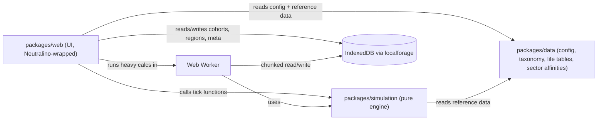
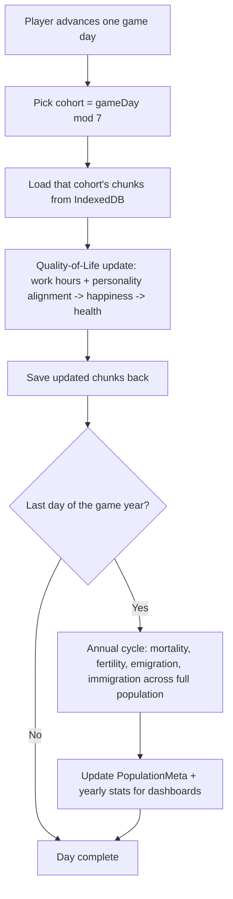

# Economy Simulator — Staged Build Plan

## Confirmed decisions

- **Map**: a procedurally generated country divided into hex-based regions/provinces. Population and sector employment can vary by region.
- **Package split**: add `packages/simulation` (pure TS calculation engine, no React) and `packages/data` (shared config + research-backed reference data, no React). `packages/web` stays UI-only and consumes both as workspace dependencies. No changes needed to `packages/desktop` — it continues to consume the web build output as-is.

## Working assumptions (flag if wrong, otherwise I'll proceed with these defaults)

- **App config** vs **Game settings**: "App config" = non-gameplay tunables (population size for dev vs release, chunk/cohort sizes, perf/feature flags). "Game settings" = simulation rules (ages, work hours, mortality/fertility/migration multipliers, personality-sector affinity weights, days-per-year). Both live in `packages/data/src/config/`.
- A "game year" is a configurable number of game days (default divisible by 7, e.g. 364) so the existing 7-cohort daily cycle lines up evenly with year boundaries.
- Regions hold aggregate stats and a population share; **per-region sector assignment** (vs. today's single national assignment) is called out as a possible follow-on stage after the map ships, not bundled into Stage 4, to keep that stage reviewable.
- Hex map library: **`honeycomb-grid`** for hex coordinate math (actively maintained, 0 runtime deps, TypeScript-first) + a hand-rolled SVG rendering layer in `packages/web`, styled with the existing Tailwind theme tokens. (`react-hexgrid`, the obvious React-specific alternative, is unmaintained since 2022 — confirmed via npm — so we get more control and less risk by pairing `honeycomb-grid`'s math with our own retro-styled SVG polygons, consistent with how `CategoryMap`/`SectorMap` already hand-roll their visuals.)
- Charts: `chart.js` + `react-chartjs-2` (as requested), themed to the existing CSS custom properties in [packages/web/src/index.css](packages/web/src/index.css).

## Architecture overview

## Simulation cadence

## Stages

### Stage 0 — Foundations: packages, config split, docs scaffolding
- Scaffold `packages/data` and `packages/simulation` (package.json, tsconfig, biome, vitest — mirroring `packages/web`'s existing setup) with root `bun run` script wiring (`--filter './packages/*'` already covers new packages).
- Expand [packages/web/src/data/game-settings.ts](packages/web/src/data/game-settings.ts) into a structured `GameSettings` shape (demographics, work/happiness, simulation cadence) and add a new `AppConfig`, both relocated to `packages/data/src/config/`.
- Update constitution (`_monorepo.md`, `_intent.md`) and `README.md` with the new package table and game premise blurb ("king over a vast country").
- No user-visible behavior change; this unblocks every later stage.

### Stage 1 — Research: demographics, life rules, mermaid diagrams
- `research/life-and-demographics.md`: sourced life-expectancy-by-age-and-sex tables and baseline fertility rate (citing public datasets such as UN World Population Prospects life tables, WHO Global Health Observatory, and/or US SSA actuarial life tables), with how quality-of-life will modulate the baseline curves.
- `research/quality-of-life-rules.md` ("life rules"): work-hours happiness penalty curve, OCEAN personality-to-sector affinity model, health-follows-happiness lag — including the mermaid diagrams you asked for (daily QoL pipeline, trait-to-sector affinity map).
- Reference tables land as typed, sourced data in `packages/data/src/demographics/life-tables.ts`.
- Update `research/index.md` as a real table of contents.

### Stage 2 — Employment & Quality-of-Life engine
- Add sector employment data (workforce share, base weekly hours per sub-sector) to `packages/data`.
- Assign each working-age `Person` a job sector at generation time (weighted by sector employment share).
- Implement `packages/simulation`'s daily Quality-of-Life update: work-hours penalty + personality/sector alignment (from Stage 1's affinity model) drives happiness; health drifts based on sustained low happiness.
- Wire this into the existing `advanceGameDay` cohort tick in [packages/web/src/storage/population.ts](packages/web/src/storage/population.ts), replacing today's placeholder `updatePersonStats`.

### Stage 3 — Annual population dynamics (births, deaths, migration)
- `packages/simulation`'s annual cycle: age-sex mortality rolls (modulated by QoL), fertility rolls for new births, emigration rolls for low-QoL citizens, immigration rolls tied to national attractiveness — all sourced from Stage 1 data.
- Runs once per game year across the full stored population (chunk-by-chunk, reusing the cohort/chunk storage from the existing 1M-person architecture).
- Track yearly aggregate stats (births, deaths, net migration, population total) in `PopulationMeta` for later dashboards.

### Stage 4 — Regions & interactive map
- Generate a fixed set of hex regions once (via `honeycomb-grid`), stored like the face pool (generated on first launch, persisted).
- Assign each `Person` a home region; compute per-region aggregates (population, avg happiness/health).
- Build a new `CountryMap` component: SVG hex tiles colored by a selectable stat, click-to-inspect region detail panel — styled to match the existing retro/arcade theme.
- Flag per-region sector assignment as a follow-on stage rather than bundling it here.

### Stage 5 — Charts & dashboards
- Add `chart.js` + `react-chartjs-2`; build a small theme adapter mapping our CSS color tokens into chart colors with a chunky/retro look (no smoothed curves).
- New dashboard pages: Population (age-sex pyramid, happiness/health distributions, births/deaths/migration trend), Economic Sectors (employment share, avg happiness by sector, economic-system mix), Country Overview (national QoL trend, region leaderboard table).

### Stage 6 — Calculation progress modal + Web Worker
- Reusable retro-styled `CalculationModal` with a progress bar (extending the pattern already used on the population generation screen).
- Move the annual cycle (and optionally the daily tick) into a Web Worker that imports `packages/simulation`, reports progress, and the modal reflects it — so a 1,000,000-person annual calculation doesn't freeze the UI.

### Stage 7 — Config consolidation & polish
- Finalize `AppConfig`/`GameSettings` as the single tunable source of truth used by simulation, web, and data packages; document every field's purpose and default.
- Final constitution/README pass reflecting the shipped architecture.
- Full-repo `bun run lint:fix` && `bun run typecheck` && tests across all three packages.

## Testing approach (every stage)

- Pure calculation functions (mortality, fertility, happiness, hex math) get unit tests in `packages/simulation`/`packages/data`.
- Storage/orchestration logic gets integration tests against mocked `localforage`, following the existing pattern in [packages/web/src/storage/population.test.ts](packages/web/src/storage/population.test.ts).
- New UI (map, dashboards, modal) gets at minimum a rendering/interaction smoke test; chart/table data-transformation helpers are extracted as pure functions so they're unit-testable without mounting a chart.
- No stage's code is considered done until its package's `test`, `typecheck`, and `lint` scripts pass with zero errors.

## End-of-stage verification checklist (repeat before moving to the next stage)

1. **Run the gates**: `bun run lint:fix`, `bun run typecheck`, and `bun run test` (or the relevant package's `test` script) — all must pass clean.
2. **Review the diff**: re-read every changed/added file for the stage against this plan's description of that stage — confirm no scope crept into the next stage's work and no leftover TODOs/dead code.
3. **Sanity-check behavior**: for logic-heavy stages (2, 3, 4), run a small ad-hoc script or test against a synthetic population to confirm outputs are directionally correct (e.g. higher work-hours lowers happiness, higher mortality age increases death odds) — not just "it compiles."
4. **Regression check**: confirm prior stages' tests still pass (no silent breakage of earlier work, e.g. cohort tick, face pool, population storage).
5. **Summarize**: report back what was verified and any deviations from the plan before starting the next stage, so issues surface immediately rather than compounding across stages.
