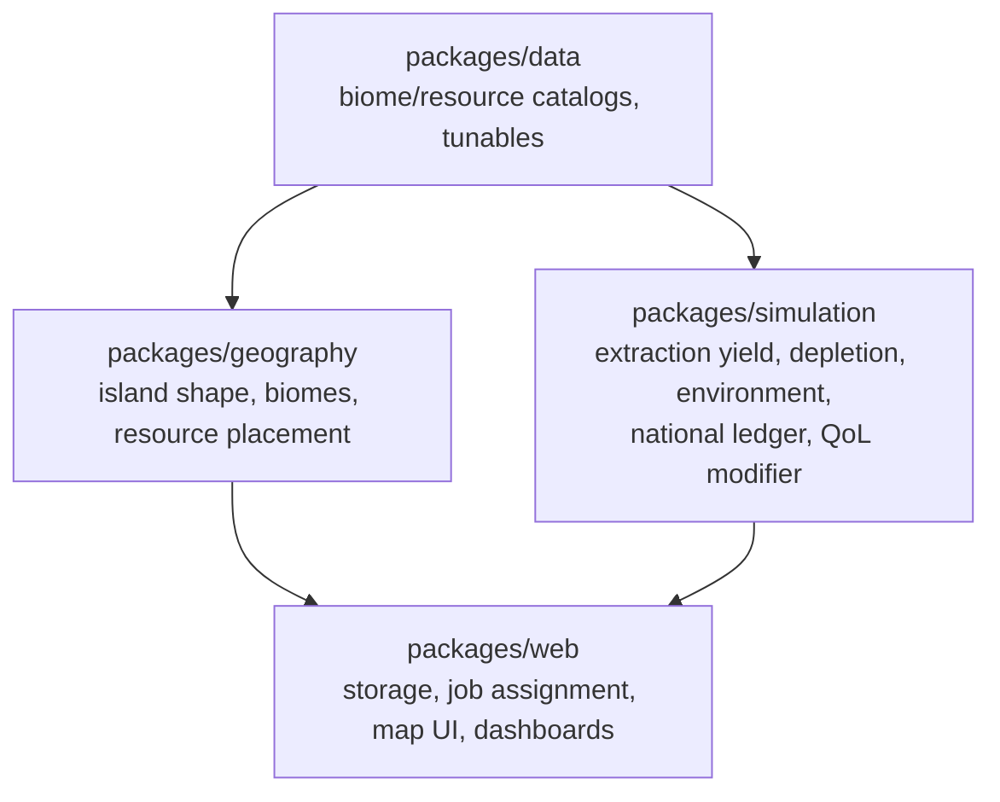
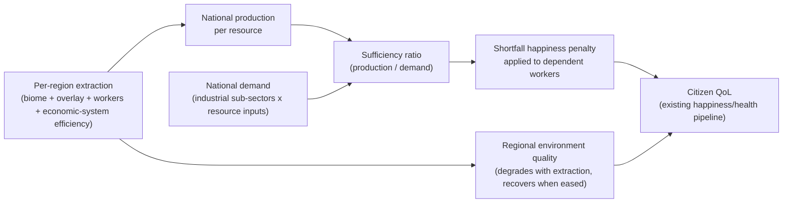

# Island Resources and Terrain

## Scope confirmed with user

- **Economy depth**: single-country resource ledger (production vs. demand, sufficiency ratios), no inter-region trade/pricing/stockpile markets. The monarchy "orchestrates the flow" through the **economic system already assignable per sub-sector** ([`packages/web/src/data/economic-systems.ts`](packages/web/src/data/economic-systems.ts)) — this assignment currently has zero mechanical effect; this project gives it real teeth (efficiency/environmental-impact multipliers).
- **Tile model**: terrain/biome per land tile (determines which extractive sub-sectors are viable there) plus rarer bonus resource overlays (fresh water, ore vein, fossil fuel field, fertile soil) — Civ-like, richer than one-resource-per-tile Catan.
- Single contiguous island per game (not an archipelago), organic/irregular shape, different every game, fully surrounded by ocean tiles.

## New package boundaries

Following the existing split (`data` = definitions/tunables, `simulation` = pure calculation, `web` = I/O+UI), add one new package and extend two existing ones:

- **`packages/geography`** (new) — pure, deterministic (seeded) world generation: island shape, biome assignment, resource-overlay placement, coastal/adjacency detection. No React, no I/O — mirrors `packages/simulation`'s "pure engine" rule.
- **`packages/data`** (extend) — biome/resource-overlay catalogs, industrial resource-input requirements, economic-system efficiency/environment multipliers, new `GameSettings`/`AppConfig` tunables (bounding radius, target land ratio, depletion/regen/degradation rates).
- **`packages/simulation`** (extend) — new `resources/` module: extraction yield, finite-resource depletion, renewable regen/over-extraction, environmental degradation/recovery, national ledger aggregation, and a new `environmentalQualityModifier` wired into the daily QoL pipeline.
- **`packages/web`** (extend) — persistence for full world state, region-aware job assignment, map/dashboard UI.

## Resource and biome model (v1 defaults, tunable)

Biomes (land tiles) and the extractive sub-sector(s) each enables:

| Biome | Enables |
| --- | --- |
| Plains | Agriculture |
| Pasture | Livestock |
| Forest | Forestry |
| Hills | Quarrying, some Mining — Metals |
| Mountains | Mining — Metals, Mining — Energy |
| Wetland | Agriculture (bonus), boosts fresh-water access |
| Desert | Low/no yield (the "bad" tile, as in Catan) |
| any coastal land tile (adjacent to ocean) | Fishing & Aquaculture |

Bonus overlays (rarer, one per tile at most): Fresh Water Spring, Rich Ore Vein, Fossil Fuel Field, Fertile Soil.

Renewable vs. finite: Agriculture/Livestock/Forestry/Fishing are renewable (regenerate yearly, degrade if over-extracted); Mining — Metals/Energy and Quarrying are finite (permanently deplete; yield tapers as reserves run low, hits zero at exhaustion). A fully depleted/over-extracted tile can flip to a degraded terrain variant (e.g. Forest to Cleared Land, Mountain to Stripped Mountain) — a visible, mechanical scar from extraction.

Industrial sub-sectors get a new sourced-in-spirit "resource inputs" table (e.g. Heavy Industry needs Metal Ore + Fossil Fuel; Construction needs Quarried Stone + Timber; Food Processing needs Agriculture + Livestock; Utilities needs Fossil Fuel + Fresh Water) documented in the new research doc as a designed (not empirically sourced) input-output simplification, same spirit as the existing "v1 simplification" note on `employmentWeight`.

## National resource ledger (annual, monarchy-orchestrated)

Economic-system assignment (already player-facing, currently cosmetic) gains a small efficiency/environmental-impact/morale multiplier table — e.g. more centrally planned systems trade some output for lower environmental impact, market systems trade the reverse. This is the primary lever the plan gives the player to react to ledger shortages.

## Staged implementation

1. **Research & data foundations** — new [research/resources-and-geography.md](research/resources-and-geography.md) (island/biome generation approach, resource taxonomy, extraction/depletion/environment model, sourcing what's genuinely researched — e.g. extraction-pollution-to-health literature, resource-curse/Dutch-disease framing for the ledger concept — and clearly labeling the yield/depletion numbers as a designed game model, consistent with existing "v1 simplification" notes). Scaffold `packages/geography` and extend `packages/data` with biome/resource/economic-system-effect catalogs and new tunables.
2. **World generation** (`packages/geography`) — organic seeded island growth (flood-fill from a center seed with distance falloff + noise) on a larger bounding hex grid, guaranteeing a single contiguous landmass surrounded by ocean; biome assignment (coast-distance/elevation-noise driven); resource-overlay scattering; coastal/adjacency helpers. Heavy unit-test coverage (contiguity, single-landmass invariant, deterministic seeding, distribution ratios within configured bounds).
3. **Resource economics** (`packages/simulation/src/resources/`) — extraction yield, finite depletion + renewable regen/over-extraction + terrain-degradation transitions, regional environment quality, national ledger aggregation (production/demand/sufficiency), new `environmentalQualityModifier` in the daily QoL pipeline, economic-system efficiency multipliers.
4. **Storage & job assignment** (`packages/web`) — persist full world state (terrain/resources/reserves/environment) with a version bump (existing regions are just names+coords today, forcing regen on load like `storageVersion` does for population); run the resource ledger update inside the existing annual cycle; make extractive job assignment region-aware (a citizen can only work an extractive sub-sector their home region actually supports) while non-extractive categories stay country-wide random as today.
5. **Map & dashboard UI** (`packages/web`) — render the irregular island + ocean, biome/resource iconography, a "Terrain" map-metric view; **fix the tooltip/selection overlap** with a real positioned hover tooltip and a non-clashing selection treatment (z-order raise + glow instead of just a thicker border); extend the region inspector panel with terrain/resources/reserves/environment; new "Resource Ledger" dashboard tab (production/demand/sufficiency/reserve trend charts, reusing the existing Chart.js retro theme).
6. **Tests, docs, full regression** — unit tests across all three packages, component tests for map/tooltip/dashboard changes, updated + new Playwright specs (existing map/dashboards specs need updating for the new island shape and ledger tab), `research/index.md`, `constitution/_monorepo.md` (new package), `constitution/_tech-stack.md`, `constitution/_intent.md` (island-nation framing), and README updates. Full `lint:fix` / `typecheck` / `test` / `test:e2e` pass at the end, same as prior stages.

Given the size (comparable to or larger than the original staged build), this will be executed stage-by-stage with a todo list, marking items `in_progress`/`completed` as work proceeds, and running lint/typecheck/tests after each stage before moving on.
