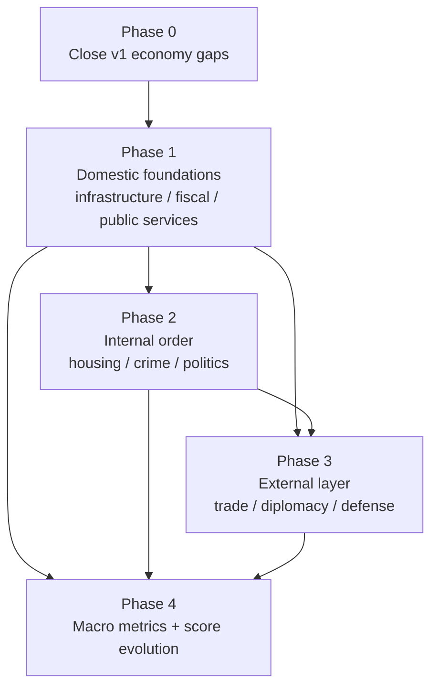

# Nation Management Roadmap

Product roadmap for closing **documented v1 gaps**, then growing the game from a domestic island economy sim into a fuller **nation-management** experience — without abandoning the current QoL / extraction / calamity core.

## Research to read before implementing

Sourced baselines (citations, design implications, sourced-vs-designed boundaries) live under [`research/`](../../research/index.md). **Do not invent curves from scratch** when picking up a phase todo — extend the matching research doc and put magnitudes in `GameSettings`.

| Phase | Research doc |
| --- | --- |
| 0 | [stockpiles-flows-and-regional-employment.md](../../research/stockpiles-flows-and-regional-employment.md) |
| 1 | [infrastructure-fiscal-services.md](../../research/infrastructure-fiscal-services.md) |
| 2 | [housing-order-politics.md](../../research/housing-order-politics.md) |
| 3 | [trade-diplomacy-defense.md](../../research/trade-diplomacy-defense.md) |
| 4 | [macro-metrics.md](../../research/macro-metrics.md) |

This plan remains the authority for **staging, package ownership, UI surfaces, and non-goals**. The research docs are the authority for **why** a mechanic points the way it does.

## Current baseline (shipped)

The loop today is intentionally **domestic and single-island**:

| Layer | What exists |
| --- | --- |
| Geography | Procedural island, biomes, resource overlays, terrain degradation |
| Economy | 38 sub-sectors, economic systems + roles, national resource ledger (production vs industrial demand) |
| People | Daily QoL, annual births/deaths/migration |
| Events | Calamities (Relief / Rebuild / Endure), weekly briefings, aide proposals, mandates |
| Meta | Nation score, win/lose, badges |

**Not** simulated as systems today: fiscal state, infrastructure stock, foreign nations, military, crime, housing markets, education/health policy, monetary policy, GDP/Gini/HDI. Many of those words appear as **employment labels** or in `packages/web/public/economic-*.md` reference docs only.

## Design principles

1. **Domestic first** — finish the island as a coherent kingdom before inventing foreign actors.
2. **Reuse existing channels** — new systems should pressure happiness, health, environment, extraction, ledger sufficiency, emigration, and nation score rather than invent parallel win conditions.
3. **Sectors become real** — tertiary / quaternary / quinary jobs should gradually gain sector-specific mechanics instead of remaining pure employment labels.
4. **Pure engine, impure shell** — catalogs/tunables in `packages/data`, calculation in `packages/simulation`, orchestration/UI in `packages/web`, persistence in `packages/persistence`.
5. **Copy vs logic** — player-facing dialogue stays under `packages/data/src/copy/`; balance numbers stay in TypeScript.
6. **No calendar estimates** — phases are ordered by dependency and invasiveness, not weeks/days.



---

## Phase 0 — Close documented v1 gaps

These items were explicitly deferred or left unfinished in existing plans/research. Do these **before** new nation-management pillars so later systems have real material to spend, move, and score against.

### 0a. Wire unfinished v1 hooks (low invasiveness)

| Gap | Evidence | Target |
| --- | --- | --- |
| Weekly `emigrationRisk` choice | Defined in `packages/data/src/briefings/weekly-reports.ts` (“dispatch only in v1”) but not consumed by web/sim | Apply a short emigration modifier when the player picks Endure-style weekly options |
| Calamity agency beyond scalars | `.cursor/plans/calamity_design_rec_08b50422.plan.md` — “later: stockpiles, relief spending” | Add hooks so Relief/Rebuild can optionally spend treasury/stockpile once Phase 0c/1b exist; until then, keep scalar responses but document the spend API |

**Deliverables:** simulation modifiers + tests; Instructions / How-to-rule copy updates if player-visible.

### 0b. Per-region non-extractive employment (medium)

Today only **extractive** jobs are region-gated (`packages/simulation/src/employment/job-assignment.ts`). Plans flagged full per-region sector assignment as follow-on (`.cursor/plans/economy_simulator_game_systems_d8cbdca1.plan.md`).

**Target:**

- Industrial / services / knowledge / command employment shares vary by province (capacity, population density, infrastructure later).
- Labor edicts can move workers **within and across** regions with readable limits.
- Map + Population UX show regional job mix.

**Risk:** storage and assignment cost at 1M citizens — prefer aggregate regional tallies + sampled citizen updates, matching existing cohort patterns.

### 0c. National stockpiles (medium)

Research deliberately excluded stockpiles (`research/resources-and-geography.md`). Closing this gap unlocks calamity agency and fiscal spending.

**Target:**

- Per-resource national stockpile with carry-over between years.
- Extraction fills stockpiles; industrial demand draws down; shortfalls still apply when stockpile + production cannot cover demand.
- Calamity onset can destroy stockpile fractions (warehouse fire, etc.).
- Relief/Rebuild responses can spend stockpiles to blunt mid-term severity.

**Non-goal for 0c:** market prices between private actors.

### 0d. Inter-region resource flows (medium–high)

Also excluded in v1 research scope. This stays **domestic** (no foreign nations yet).

**Target:**

- Regions with surplus extraction can supply deficit regions via a simple flow model (distance / transport-logistics employment as friction).
- Optional lightweight “shadow price” or scarcity signal for UI — not a full commodity exchange.
- Transport & logistics sub-sector gains its first real mechanic (throughput / friction).

**Depends on:** 0b (regional employment), 0c (something to move).

### 0e. Calamity catalog polish (low–medium)

`GameSettings.calamities.enabledTiers` already includes `v1.5` / `v2`, and catalog/copy exist for many entries. Finish mechanical fairness and agency:

- Bias weights from world state (over-extracted timber → more forest fire; low QoL → food riot).
- Ensure social/political calamities remain debuffs until Phase 2 politics exists — do not pretend they are full governance.
- Cascade rules from the calamity plan where still missing.

**Exit criteria for Phase 0:** the island has regional labor depth, stored resources, domestic flows, and calamity responses that spend something real.

---

## Phase 1 — Domestic foundations

Turn three “reference doc” pillars into gameplay. These are the load-bearing systems every later nation feature should plug into.

### 1a. Infrastructure capital stock

**Problem:** Construction / Utilities / Telecom are employment labels; docs mention `capitalStock` and infrastructure quality indexes (`packages/web/public/economic-sectors.md`) with no engine type.

**Target:**

- Nation + optional regional **infrastructure indices** (transport, power/water, digital).
- Construction & utilities employment + fiscal investment raise indices; neglect and calamities (`power_outage`, `bridge_collapse`, quakes) lower them.
- Indices multiply extraction efficiency, inter-region flow capacity (0d), and public-service delivery (1c).

**Player levers:** budget line (once 1b), labor edicts into construction/utilities, Rebuild calamity response.

### 1b. Fiscal core (treasury, taxes, budgets)

**Problem:** No treasury; “tax policy” exists only in Quinary docs and economic-system flavor.

**Target:**

- Annual **treasury** balance: tax revenue − spending − debt service.
- Simple tax levers (overall rate bands and/or sector-tilted rates) affecting happiness / emigration and revenue.
- Budget allocations: infrastructure, healthcare, education, relief reserve, (later) police / military.
- Deficits allowed within a soft cap; sustained insolvency pressures score and political legitimacy (Phase 2).

**Integration:**

- Calamity Relief/Rebuild spend treasury and/or stockpiles.
- Economic systems bias default tax/spend preferences (cosmetic defaults the player can override).

**Non-goal for 1b:** full monetary policy / inflation (can wait until Phase 4 or a thin Phase 3 add-on).

### 1c. Public-service policy (healthcare & education)

**Problem:** Healthcare / Education / Higher Education are jobs; health is almost entirely QoL-lagged happiness; weekly “medical campaign” choices are one-off deltas.

**Target:**

- **Coverage** and **quality** metrics funded by budget lines and sector staffing.
- Healthcare quality reduces disease calamity severity and raises health floor; education quality slowly improves personality–job fit or future productivity (keep the model small — one clear channel).
- Underfunding → coverage gaps → happiness/health/emigration penalties, especially in low-infrastructure regions.

**Exit criteria for Phase 1:** the monarch manages **money, capital, and people** for domestic services — not only job mix and economic systems.

---

## Phase 2 — Internal order & politics

Build the “kingdom at home” layer that makes Command / Public Administration sectors meaningful.

### 2a. Housing stock & affordability

- Housing stock grows via construction investment + real-estate/construction labor.
- Crowding / unaffordability applies regional happiness penalties and emigration.
- Ties to infrastructure (1a) and fiscal housing/public-works spend (1b).

### 2b. Internal order (crime, police, justice)

- Order index from public-administration staffing + police/justice budget + QoL/poverty pressure.
- Low order → happiness hit, mild extraction/services efficiency drag, higher social-calamity weights (`food_riot`, `plague_of_corruption`).
- No need for individual crime simulation — regional aggregates only.

### 2c. Domestic politics (legitimacy & pressure)

Keep the monarchy fantasy; do **not** require elections unless desired later.

**Target:**

- **Legitimacy** / consent meter driven by QoL, fiscal fairness, order, mandate success, calamity response choices.
- Legislature & Judiciary / Executive Government staffing and aide outcomes nudge legitimacy.
- Low legitimacy amplifies social calamities and can force harder weekly/aide choices (fewer good options).
- Corruption pressure as a slow drain reducible by funding + role reforms in admin/command sectors.

**Exit criteria for Phase 2:** failing at home feels political, not only economic.

---

## Phase 3 — External layer

Only after the island can feed, house, fund, and police itself. This is the largest scope jump: it introduces **actors outside the island**.

### 3a. Foreign trade

- Abstract trade partners (not full rival sims at first): import fill for ledger gaps; export demand for surplus stockpiles.
- Tariffs / openness levers; mercantilist economic systems bias defaults.
- Trade balance feeds treasury (1b) and can import environmental/social externalities lightly.

### 3b. Diplomacy / foreign relations

- Relation scores with abstract partners; treaties unlock trade tiers or aid.
- Sanctions / embargo events as calamity-like external shocks.
- `international-bodies` / Strategic Advisory sectors contribute soft power capacity.

### 3c. Defense / military

- Readiness from budget + relevant labor (and feudal Knight-style roles as morale/readiness flavor).
- Deterrence reduces piracy/raid-style external shocks; neglect raises them.
- Marshal aide proposals gain real military/readiness effects instead of calamity-prep flavor only.
- **Non-goal initially:** player-initiated conquest or multi-hex wars — keep defense protective/reactive so the game stays a nation sim, not a war game.

**Exit criteria for Phase 3:** the island participates in a wider world without abandoning the domestic loop.

---

## Phase 4 — Macro metrics & score evolution

Once Phases 1–2 (and ideally 3a) produce real aggregates, evolve scoring beyond today’s QoL / growth / migration / ledger / environment blend.

| Metric family | Feeds from | Score use |
| --- | --- | --- |
| Output / “GDP-like” | Extraction + industrial throughput + services activity | Replace or supplement ledger-only prosperity |
| Inequality / “Gini-like” | Role structure + fiscal redistribution + housing | Soft score + legitimacy |
| Development / “HDI-like” | Health, education, QoL | Win/lose and badges |
| Policy coherence | Fiscal + infrastructure + services alignment | Quinary fantasy made measurable |

Also eligible here (from `.cursor/plans/scores_win_lose_badges_9809be54.plan.md` future list): scenario/challenge modes, multiple save slots, leaderboards — only after metrics stabilize.

---

## What becomes of each “missing” feature

| Feature | Phase | Notes |
| --- | --- | --- |
| Stockpiles | 0c | Unlocks calamity spending |
| Inter-region trade/flows | 0d | Domestic only |
| Per-region employment | 0b | Extends extractive gating |
| Calamity relief spending | 0a → 0c/1b | Hooks then real costs |
| Infrastructure | 1a | Capital indices |
| Taxation / budget | 1b | Treasury |
| Healthcare / education policy | 1c | Coverage + quality |
| Housing | 2a | Stock + crowding |
| Crime / police / justice | 2b | Order index |
| Politics / legitimacy | 2c | Monarchy-compatible |
| Foreign trade | 3a | Abstract partners |
| Diplomacy | 3b | Relations + shocks |
| Defense / military | 3c | Readiness / deterrence |
| Monetary policy / inflation | 4 or thin 3 add-on | After fiscal exists |
| GDP / Gini / HDI scoring | 4 | Needs earlier aggregates |
| Central banking as mechanic | 4 | Builds on 1b |

---

## Package ownership (expected)

| Concern | Package |
| --- | --- |
| Tunables, catalogs, policy definitions | `packages/data` |
| Pure ticks: stockpiles, fiscal, infrastructure, order, relations | `packages/simulation` |
| Run orchestration, dashboards, throne UI | `packages/web` |
| New run-state fields | `packages/persistence` |
| Research notes + sourced curves | `research/` — **read the Phase 0–4 docs before implementing**; update them when sourced-vs-designed boundaries change |
| Product intent updates when phases ship | `constitution/` |

Prefer **extending** existing modules (`resources/`, `progression/`, briefings) over new top-level concepts until Phase 3 forces a `foreign/` or `nation/` simulation area.

## UI surfaces (incremental)

1. **Phase 0:** Resource Ledger gains stockpile + regional flow views; map employment overlay expands.
2. **Phase 1:** New **Realm** / **Treasury** dashboard — budget sliders, infrastructure bars, service coverage.
3. **Phase 2:** Order & legitimacy on Country overview; housing on region inspector.
4. **Phase 3:** Foreign desk panel (trade, relations, readiness) — keep out of the first viewport of the map home unless actively in crisis.
5. Always update Instructions + How to rule copy when levers become player-facing.

## Testing & quality gates (every phase)

- Unit tests in `packages/simulation` for new tick math.
- Data catalog tests for weights/ids.
- Web orchestration tests for year/day wiring.
- Before merge of substantive work:

```bash
bun run lint:fix
bun run typecheck
```

## Non-goals (until explicitly reopened)

- Multiplayer / asynchronous rival human monarchs
- Full agent-based crime or battlefield combat
- Real-time continuous simulation (keep day/week/year cadence)
- Replacing economic systems/roles — nation management **layers on** them
- Hand-editing generated desktop assets

## Suggested implementation order (summary)

1. **0a → 0c → 0b → 0d → 0e** — material economy depth on the island  
2. **1a → 1b → 1c** — spend money on capital and services  
3. **2a → 2b → 2c** — make neglect feel like unrest  
4. **3a → 3b → 3c** — open the border carefully  
5. **4** — score what you can finally measure  

Each todo above should ship as its own reviewable change set with docs updates (`research/`, constitution intent) when behavior changes. Implementation PRs should link the matching Phase research doc from [`research/index.md`](../../research/index.md#product-roadmap).
