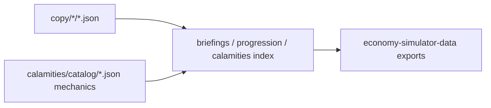

# Organize creative copy into folders

## Target layout

Normalize naming to kebab-case (your examples mixed `_` / `-` and plural forms):

```text
packages/data/src/copy/
  README.md
  how-to-rule.json
  aides/
    roster.json                    # was aides.json
    steward-proposals.json
    marshal-proposals.json
    chancellor-proposals.json
    vizier-proposals.json
  weekly/
    reports.json                   # was weekly-reports.json
  mandates/
    mandates.json
  calamities/
    responses.json                 # Relief / Rebuild / Endure labels + details
    weather.json                   # id → { name, description }
    geological.json
    biological.json
    human.json
    social.json
```



## 1. Aide proposals — split by role

- Move each aide’s entries from [`aide-proposals.json`](packages/data/src/copy/aide-proposals.json) into the four role files above (same proposal ids).
- Update [`packages/data/src/briefings/aide-proposals.ts`](packages/data/src/briefings/aide-proposals.ts) to import and deep-merge the four JSON files + [`aides/roster.json`](packages/data/src/copy/aides/roster.json).
- **Expand:** add **1 new proposal per role** (4 total) with matching logic entries, e.g.:
  - Steward: grain/stockpile labor nudge (`laborEdictPercent`)
  - Marshal: regional morale patrol (`happinessDelta` / small health tradeoff)
  - Chancellor: selective fallow (`environmentDelta` + short extraction factor)
  - Vizier: court survey (`pendingScoreBonus` / small happiness)

## 2. Weekly reports — folder + more prompts

- Move to [`copy/weekly/reports.json`](packages/data/src/copy/weekly/reports.json).
- Change each distress block to support **prompt variants**:
  - `prompts: string[]` (3 variants per existing distress) instead of a single `prompt`.
- Update [`packages/data/src/briefings/weekly-reports.ts`](packages/data/src/briefings/weekly-reports.ts) merge to pick `prompts[0]` as default for definitions (stable for tests) and export a small `pickWeeklyPrompt(tree, random)` helper used by web when building the report ([`packages/web/src/game/weekly-reports.ts`](packages/web/src/game/weekly-reports.ts)).
- **Expand choices:** add **1 extra choice** on each of the 4 existing trees (reuse existing effect shapes), with logic + copy.

## 3. Mandates — folder + more mandates

- Move to [`copy/mandates/mandates.json`](packages/data/src/copy/mandates/mandates.json).
- Add **2 mandates** with logic + evaluation in [`packages/data/src/progression/mandates.ts`](packages/data/src/progression/mandates.ts) and [`packages/web/src/game/mandates.ts`](packages/web/src/game/mandates.ts):
  - `grow_population` — `populationAfter > populationBefore`
  - `tighten_ledger` — `resourceSufficiency >= 80` (harder cousin of `resource_security`)
- Extend `MandateId` union + tests.

## 4. Calamities in copy (yes)

Today `name` / `description` live inside [`packages/data/src/calamities/catalog/*.json`](packages/data/src/calamities/catalog/) mixed with weights and effects.

- **Extract** flavor into `copy/calamities/{weather,geological,biological,human,social}.json` keyed by calamity `id`: `{ "forest_fire": { "name": "...", "description": "..." }, ... }`.
- **Strip** `name`/`description` from catalog mechanics JSON (keep ids + balance fields).
- Update [`packages/data/src/calamities/index.ts`](packages/data/src/calamities/index.ts) to merge copy onto definitions at load (throw if an id is missing copy — same pattern as aides).
- Update [`catalog.test.ts`](packages/data/src/calamities/catalog.test.ts) expectations accordingly.
- One-shot extract via a short Bun script (or inline during the change) so all **41** calamities move without hand-editing every line.
- Update [`generate-catalog.ts`](packages/data/src/calamities/generate-catalog.ts) comments/output so future regen does not re-embed flavor in mechanics files (or writes both trees).

Also move **onset response UI copy** out of [`packages/web/src/game/calamity-responses.ts`](packages/web/src/game/calamity-responses.ts) into [`copy/calamities/responses.json`](packages/data/src/copy/calamities/responses.json) (`endure` / `relief` / `rebuild` → `label` + `detail`). Keep numeric scales in TS; merge labels at import (export from data or a tiny `copy/calamities/responses.ts` helper).

## 5. Docs + cleanup

- Rewrite [`packages/data/src/copy/README.md`](packages/data/src/copy/README.md) for the folder map and “add copy + logic” workflow.
- Point constitution monorepo/copy notes at the new paths ([`constitution/_monorepo.md`](constitution/_monorepo.md), [`constitution/_intent.md`](constitution/_intent.md) if they cite flat filenames).
- Delete old flat JSON files after imports move.

## 6. Verify

- `bun run typecheck`
- `bun run --filter economy-simulator-data test`
- `bun run --filter economy-simulator-web test` (mandate + weekly + calamity response tests)

## Out of scope

- New calamity *mechanics* / new disaster ids
- New weekly distress *kinds* (would need detector changes); variants + extra choices on existing kinds only
- Renaming stable proposal/mandate/calamity ids already in saves
