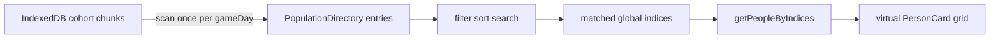

# Population page: search, sort, filter, rounding, explainers

## Decisions (locked)

- **Rounding:** display Health and Happiness with `Math.ceil` (e.g. `72.1` → `73`). Display-only; do not change stored simulation values.
- **Filters (this pass):** name search, sort (index / name / age / health / happiness, with asc/desc), region filter, living status (all / living / deceased). Skip age bands, ranges, and sector/job for now — Person already has those fields, but they add UI/query complexity without changing the architecture.
- **Explainers:** reusable `StatGlossaryModal` fed by a single `stat-glossary` data module, opened from Population (and easy to wire elsewhere later).

## Why a directory (efficiency)

The list is already virtualized and only loads a contiguous IndexedDB window via `getPersonRangeBatched`. Sort/filter by name/stats breaks contiguous index order, so we cannot filter only the visible window.

Reuse the same full-chunk scan pattern as [`computeDemographicStats`](packages/web/src/game/population-cycle.ts): once per `gameDay`, build a compact **directory** of display fields, then filter/sort that array in memory and hydrate only visible people by index.



At 100k–1M this scan is acceptable (dashboards already do it); show a short progress state while the directory rebuilds.

## Implementation

### 1. Compact directory + query helpers

Add [`packages/web/src/data/population-directory.ts`](packages/web/src/data/population-directory.ts) (+ tests):

- `PopulationDirectoryEntry`: `{ index, name, age, sex, isAlive, overallHealth, overallHappiness, regionId }`
- Pure functions: `filterDirectory(entries, filters)`, `sortDirectory(entries, sortKey, direction)`, `searchDirectory(entries, query)` (case-insensitive name substring)
- Keep query logic out of the page component so it is unit-tested without IndexedDB

Add scan + batched hydrate in [`packages/web/src/game/population-cycle.ts`](packages/web/src/game/population-cycle.ts) / re-export from [`storage/population.ts`](packages/web/src/storage/population.ts):

- `buildPopulationDirectory(onProgress?)` — chunk walk like demographic stats
- `getPeopleByIndices(indices: number[])` — group requested indices by cohort/chunk, one `loadCohortChunk` per chunk, return `Person[]` in request order

### 2. Population page controls + virtual list over matches

Update [`packages/web/src/pages/PopulationPage.tsx`](packages/web/src/pages/PopulationPage.tsx):

- Build/cache directory when `isReady` / `gameDay` changes; clear person cache on day advance (already done)
- Toolbar: search input (debounced ~150–200ms), sort select + asc/desc toggle (Country Map toggle styling), living-status toggle, region `<select>` from `useRegions()` (land regions by `region.name`, value `region.id`)
- Virtualizer `count` = filtered match count, not raw `total`
- Visible rows: map match indices → `getPeopleByIndices` for the window (± buffer), keep `Map<matchIndex, Person>` cache
- Header copy: show `N of total` matching citizens
- Empty state when filters match nothing

### 3. Ceil Health / Happiness on cards

Update [`packages/web/src/components/PersonCard.tsx`](packages/web/src/components/PersonCard.tsx):

```ts
function formatPercentStat(value: number | undefined): string {
  if (value === undefined) return "—";
  return `${Math.ceil(value)}%`;
}
```

Add [`PersonCard.test.tsx`](packages/web/src/components/PersonCard.test.tsx) covering `72.1` → `73%`, integers unchanged, undefined → `—`.

### 4. Centralized stat glossary modal

Add:

- [`packages/web/src/data/stat-glossary.ts`](packages/web/src/data/stat-glossary.ts) — entries for Health, Happiness, Big Five (O/C/E/A/N), Age, Region, Living status; copy grounded in [`research/quality-of-life-rules.md`](research/quality-of-life-rules.md) and Instructions tone (player-facing, not academic)
- [`packages/web/src/components/StatGlossaryModal.tsx`](packages/web/src/components/StatGlossaryModal.tsx) — same overlay pattern as [`GameEndModal`](packages/web/src/components/GameEndModal.tsx) / [`CalculationModal`](packages/web/src/components/CalculationModal.tsx): `role="dialog"`, dismissible close button, scrollable sections
- Wire a “What do these stats mean?” button on Population header; optional small “?” on PersonCard that opens the same modal

Tests: glossary data shape + modal open/close / headings render.

### 5. Testing

| Area | Tests |
|------|--------|
| Directory filter/sort/search | unit tests with fixture entries |
| `getPeopleByIndices` / directory build | extend [`population.test.ts`](packages/web/src/storage/population.test.ts) with small in-memory population |
| PersonCard ceil | unit test |
| StatGlossaryModal | unit test |
| PopulationPage controls | unit test with mocked `getPersonRange` / directory (or thin hook extraction if page is too heavy) |
| E2E | light touch in [`population.spec.ts`](packages/web/e2e/population.spec.ts): search box visible, glossary opens |

Quality gates after implementation: `bun run lint:fix` and `bun run typecheck`.

## Out of scope

- Persisted secondary IndexedDB indexes
- Filtering by sector/job, age bands, or health/happiness ranges (same directory can grow later)
- Changing map/dashboard aggregate formatting (still `.toFixed(1)` for averages) — only Person-facing Health/Happiness ceil unless you want aggregates aligned later
