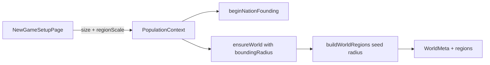

# Region scale on new-game setup

## Intent

On [NewGameSetupPage](packages/web/src/pages/NewGameSetupPage.tsx), next to population size, let the player pick **Few / Medium / More** provinces. That choice sets `boundingRadius` when the world is first generated. **More provinces = easier** (lower citizens/tile, calamities hit a smaller fraction of the map).

Shrink the whole ladder below today’s 169-tile (radius 7) map. **More** is the former Medium size (radius 5 ≈ 91 tiles / ~50 land); Few and Medium are smaller still. Radius 7 is no longer a player option.

| Label | `boundingRadius` | ~tiles / ~land (55%) | Role |
| --- | --- | --- | --- |
| Few | 3 | 37 / ~20 | Hardest — densest, calamities hit more of the island |
| Medium | 4 | 61 / ~34 | Middle ground |
| More | 5 | 91 / ~50 | Largest option — easiest of the three; new default |

Core loops already iterate whatever regions exist (population assignment, extraction, map, calamities). No need to retune `maxRegions` or calamity frequency — absolute caps naturally make **More** easier relative to Few/Medium.



## Config

In [packages/data/src/config/app-config.ts](packages/data/src/config/app-config.ts), extend `regions` with player options and **change** `boundingRadius` from `7` → `5` so the engineering fallback matches **More**:

```ts
boundingRadius: 5, // was 7; now equals More
regionScaleOptions: [
  { id: "few", label: "Few", boundingRadius: 3 },
  { id: "medium", label: "Medium", boundingRadius: 4 },
  { id: "more", label: "More", boundingRadius: 5 },
],
defaultRegionScale: "more",
```

Default UI selection is **More**. Do **not** mutate global `appConfig.regions.boundingRadius` at runtime — pass the chosen radius into generation so tests and other callers stay deterministic. Existing in-progress saves keep their stored regions (including any old radius-7 worlds); no forced regen.

## Persistence

- Extend [WorldMeta](packages/persistence/src/types/world.ts) with `boundingRadius: number` (written at create time in [ensureWorld](packages/web/src/repos/world.ts)). Existing saves without the field still load via current `worldVersion` check; no forced regen of active runs.
- Extend [GameRunState](packages/persistence/src/types/progression.ts) with `boundingRadius: number` (set in `createInitialGameRunState` / nation founding) so restart-from-end-game can reuse the same map size alongside `startingPopulation`.

## Generation plumbing

1. [buildWorldRegions](packages/web/src/lib/world.ts) — accept optional `boundingRadius` (default `appConfig.regions.boundingRadius`); pass it to `generateRegionCoordinates` and `generateWorld`.
2. [ensureWorld](packages/web/src/repos/world.ts) — when creating a new world, accept `boundingRadius` and persist it on meta; when loading existing, ignore the arg and return stored regions.
3. [PopulationContext](packages/web/src/context/PopulationContext.tsx) / [nation-setup](packages/web/src/game/nation-setup.ts) / [new-game](packages/web/src/game/new-game.ts) — thread `{ size, boundingRadius }` (or `regionScale` resolved to radius) through `startGeneration` → founding → `ensureWorld`.
4. [App.tsx](packages/web/src/App.tsx) + [AppShell](packages/web/src/components/AppShell.tsx) restart path — pass stored `gameRun.boundingRadius` (fallback More / 5) when restarting.
5. `VITE_POPULATION_SIZE` bypass — use More radius (5).

## UI

On [NewGameSetupPage](packages/web/src/pages/NewGameSetupPage.tsx):

- Second fieldset: **Island size** (or **Provinces**) with Few / Medium / More radios from `regionScaleOptions`.
- Short helper copy: more provinces spread people thinner and ease regional pressure; fewer pack the same population tighter.
- Change `onStart` to `(options: { size: number; boundingRadius: number })` (or equivalent). Update [NewGameSetupPage.test.tsx](packages/web/src/pages/NewGameSetupPage.test.tsx) and any e2e that asserts the continue callback.

Match existing arcade/title-screen styling (same radio card pattern as population).

## Balance guard (avoid breaking score logic)

[computeAverageEnvironmentQuality](packages/web/src/game/population-cycle.ts) currently averages **all** resource states, including ocean tiles stuck at 100. Larger maps would inflate environment score. Change it to average **land regions only** (pass terrains or filter when computing), so Few/Medium/More stay comparable on the environment win/lose axis.

No changes to calamity `maxRegions`, weekly top-3, or sustainable worker capacity — those already produce the intended ease gradient when land count changes.

## Tests / docs

- Unit: `buildWorldRegions(seed, 3)` vs `5` produce expected tile counts; `ensureWorld` persists chosen radius; setup page submits both size and radius; default selection is More.
- Update any tests that hard-assume `boundingRadius === 7` / 169 tiles to expect **5** / 91 (or pass an explicit radius).
- Light touch on nation-setup / new-game tests that call founding.
- Note in [research/resources-and-geography.md](research/resources-and-geography.md) that bounding radius is player-chosen (More = 5 ≈ 91 tiles; former default 7 retired).
- Constitution: only if you treat this as a product-settings change worth a one-line mention under AppConfig vs GameSettings — optional; config already lives in `appConfig`.

## Out of scope

- Changing population size options or coupling size↔radius automatically.
- Retuning calamity frequency / catalog caps.
- Regenerating worlds for in-progress saves.
- Editing legacy `packages/web/src/data/` / `storage/` duplicates unless something still imports them for this path (active path is `lib/` + `repos/`).
