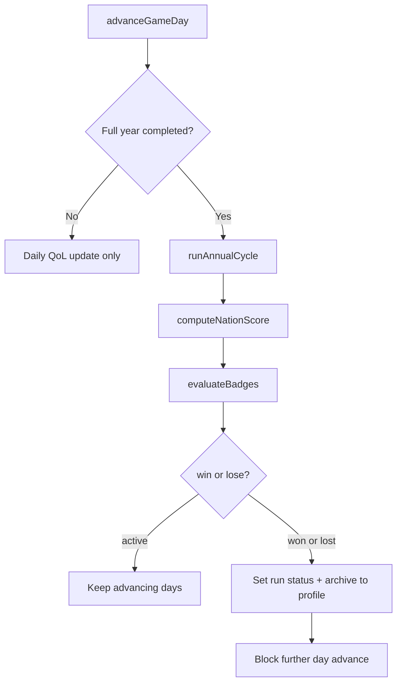
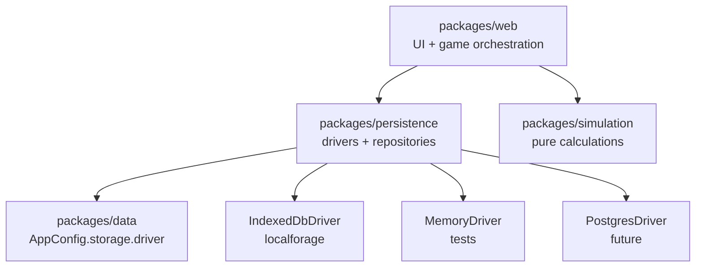

# Scores, Win/Lose, and Badges

## Current state

The sim is an **open-ended sandbox** with rich telemetry but no meta-game:

- Per-year aggregates live in [`PopulationMeta.yearlyStats`](packages/web/src/storage/population.ts) (`AnnualCycleStats`: population deltas, avg QoL).
- Resource outcomes live in [`NationalLedger`](packages/simulation/src/resources/national-ledger.ts) (sufficiency, shortfalls).
- Environment state lives in region resource stores ([`packages/web/src/storage/world.ts`](packages/web/src/storage/world.ts)).
- Persistence is **single-slot IndexedDB** via localforage; **seven storage modules** each call `localforage.createInstance` directly ([`population.ts`](packages/web/src/storage/population.ts), [`world.ts`](packages/web/src/storage/world.ts), [`national-ledger.ts`](packages/web/src/storage/national-ledger.ts), [`regions.ts`](packages/web/src/storage/regions.ts), [`faces.ts`](packages/web/src/storage/faces.ts), [`sector-assignments.ts`](packages/web/src/storage/sector-assignments.ts)); no shared driver abstraction yet; no player profile store exists.
- Design docs describe composite scores ([`economic-systems.md`](packages/web/public/economic-systems.md), [`economic-sectors.md`](packages/web/public/economic-sectors.md)) using GDP/Gini/etc. that **are not simulated yet** — the first scoring pass should use metrics we already compute.

**Primary hook point:** year boundary inside [`advanceGameDay`](packages/web/src/storage/population.ts) → `runAnnualCycle()` (lines 576–582). Population only changes annually, so win/lose evaluation belongs there.



---

## Storage driver abstraction (`packages/persistence`)

Before adding progression stores, extract persistence into a **dedicated package** so IndexedDB is one driver implementation and Postgres (or an HTTP API) can be swapped in later — reusable by `packages/web` today and a future Bun/Node API server without duplicating the port.

### Package layout

New workspace package: **`economy-simulator-persistence`** (`packages/persistence/`).



| Layer | Responsibility | Location |
| --- | --- | --- |
| **Driver port** | Async key-value API over named stores | `packages/persistence/src/driver/types.ts` |
| **Driver impls** | IndexedDB (default), in-memory (tests) | `packages/persistence/src/driver/indexed-db-driver.ts`, `memory-driver.ts` |
| **Driver factory** | `createStorageDriver()`, registry for test injection | `packages/persistence/src/driver/registry.ts` |
| **Repositories** | Typed load/save/clear per game concern (no simulation logic) | `packages/persistence/src/repositories/*.ts` |
| **Orchestration** | `advanceGameDay`, `runAnnualCycle`, UI wiring | Stays in `packages/web` — calls repositories + simulation |

**Dependency moves:** `localforage` moves from `packages/web` → `packages/persistence`. Web adds `"economy-simulator-persistence": "workspace:*"`.

**Constitution update:** revise principle 4 — `packages/persistence` owns storage drivers and repositories; `packages/web` owns UI and game-loop orchestration; `packages/simulation` stays pure (no I/O).

### `StorageDriver` interface

Thin KV port matching today's localforage usage (keeps Postgres migration straightforward via a `jsonb` table or remote KV API):

```typescript
type StorageStoreName =
  | "population"
  | "world"
  | "regions"
  | "faces"
  | "sector-data"
  | "player-progress";  // new

interface StorageDriver {
  get<T>(store: StorageStoreName, key: string): Promise<T | null>;
  set<T>(store: StorageStoreName, key: string, value: T): Promise<void>;
  remove(store: StorageStoreName, key: string): Promise<void>;
  clear(store: StorageStoreName): Promise<void>;
}
```

- **`IndexedDbDriver`**: wraps `localforage.createInstance({ name: "economy-simulator", storeName })` — preserves today's IndexedDB layout and existing saves.
- **`MemoryDriver`**: `Map<store, Map<key, unknown>>` for unit tests in both `persistence` and `web`.
- **`PostgresDriver`** (future subpath or optional dep): maps `(store, key)` → `storage_entries(store, key, value jsonb)`; usable from a future API process without pulling in React or Vite.

### Configuration

Add to [`app-config.ts`](packages/data/src/config/app-config.ts):

```typescript
storage: {
  driver: "indexeddb" as "indexeddb" | "postgres",
}
```

`createStorageDriver(config)` in persistence reads `appConfig.storage.driver`. Web bootstraps once at app init:

```typescript
import { createStorageDriver, setStorageDriver } from "economy-simulator-persistence";
setStorageDriver(createStorageDriver(appConfig.storage));
```

Tests call `setStorageDriver(new MemoryDriver())` in `beforeEach`.

### Repository refactor

Move I/O from [`packages/web/src/storage/`](packages/web/src/storage/) into persistence repositories; web keeps only orchestration:

| Current web module | Moves to persistence | Stays in web |
| --- | --- | --- |
| `population.ts` (load/save meta, chunks) | `repositories/population.ts` | `game/population-cycle.ts` — `advanceGameDay`, `runAnnualCycle`, stat aggregation |
| `world.ts`, `national-ledger.ts` | `repositories/world.ts`, `national-ledger.ts` | — |
| `regions.ts`, `faces.ts`, `sector-assignments.ts` | same-named repositories | — |
| `resource-extraction.ts` | `repositories/resource-extraction.ts` (I/O only) or stays in web if tightly coupled to annual cycle | annual extraction orchestration |

**New progression repositories** (`game-run.ts`, `player-profile.ts`) live in `packages/persistence` from day one.

Web imports repositories, not `localforage` or `StorageDriver` directly (except bootstrap).

### Postgres path (documented, not built now)

1. Add `PostgresDriver` in `packages/persistence/src/driver/postgres-driver.ts`.
2. Future API server depends on `economy-simulator-persistence` + `pg` — same repositories, different driver at bootstrap.
3. Flip `appConfig.storage.driver` (or per-environment override).
4. Optional one-time migration script: export IndexedDB → bulk insert Postgres.

If normalized relational tables are needed later, add repository-level interfaces above the KV driver — the driver port remains the lowest swap point.

### Package scaffold

Mirror existing packages (`data`, `simulation`): `package.json` with `main`/`types` → `./src/index.ts`, Biome + `tsc` + vitest scripts, no build step.

---

## Architecture: two persistence tiers

| Tier | Store | Scope | Contents |
| --- | --- | --- | --- |
| **Run state** | `population` store, key `game-run` | Current nation save | `status`, `endReason`, `startedAt`, `scoreHistory[]`, `streakCounters`, per-run badge unlocks |
| **Player profile** | `player-progress` store, key `player-profile` | Survives new games | `wins`, `losses`, `bestScore`, `unlockedBadges[]`, capped `runHistory[]` |

Follow existing convention: **pure logic in `packages/simulation` + `packages/data`**, **storage I/O in `packages/persistence`**, **orchestration + UI in `packages/web`**.

### Run state shape (new)

```typescript
type GameRunStatus = "active" | "won" | "lost" | "abandoned";

interface YearlyNationScore {
  year: number;
  total: number;           // 0–100 composite
  populationGrowth: number;
  averageQualityOfLife: number;
  netMigration: number;    // immigrations − emigrations
  resourceSufficiency: number; // avg across ledger entries
  environmentHealth: number;   // avg region environment quality
}

interface GameRunState {
  status: GameRunStatus;
  startingPopulation: number;
  startedAt: number;       // real-world timestamp
  endedAt?: number;
  endReason?: string;      // e.g. "population_collapse", "prosperity_achieved"
  scoreHistory: YearlyNationScore[];
  streaks: WinLoseStreaks; // consecutive years meeting fail/succeed thresholds
  unlockedThisRun: BadgeId[];
}
```

### Player profile shape (new store)

```typescript
interface PlayerProfile {
  version: number;
  wins: number;
  losses: number;
  abandoned: number;
  bestScore: number;
  totalYearsRuled: number;
  unlockedBadges: BadgeUnlock[];  // { id, unlockedAt, runId? }
  runHistory: RunSummary[];        // capped (e.g. 50), newest first
}
```

**New-game flow** ([`NewGameSetupPage`](packages/web/src/pages/NewGameSetupPage.tsx)):
1. If an active run exists → prompt: abandon (archive as `abandoned`) or cancel.
2. Archive current `GameRunState` + final score into `PlayerProfile.runHistory`.
3. Clear population/world/ledger stores (existing test helpers become the basis for a player-facing reset).
4. Initialize fresh `GameRunState` with `status: "active"`.

---

## Scoring engine (Phase 1 — use existing metrics)

Add pure functions in [`packages/simulation/src/progression/`](packages/simulation/src/progression/) (new folder):

**Input:** `AnnualCycleStats`, `NationalLedger`, region environment averages, starting population.

**Composite nation score (0–100)** — initial weights in [`packages/data/src/config/game-settings.ts`](packages/data/src/config/game-settings.ts):

| Component | Source today | Weight (initial) |
| --- | --- | --- |
| QoL | `averageQualityOfLife` | 30% |
| Population growth | `(after − before) / before` | 25% |
| Net migration | `(immigrations − emigrations) / before` | 15% |
| Resource sufficiency | mean `production / demand` from ledger | 20% |
| Environment health | mean region `environmentQuality` | 10% |

Normalize each component to 0–100 before weighting. Export `computeNationScore()` from `packages/simulation`.

**Defer** GDP/Gini/HDI from design docs until those metrics exist in the engine; structure `YearlyNationScore` so new components can be added without migration pain.

Wire scoring in web orchestration (`game/population-cycle.ts`, extracted from today's `population.ts`): after `runAnnualCycle` stats + resource extraction, call `computeNationScore`, append to `GameRunState.scoreHistory`, persist via persistence repositories.

---

## Win/lose conditions (every game ends)

Define thresholds in `game-settings.ts` under a new `progression` section. Evaluate **once per completed game year** (and immediately when population hits 0 after annual cycle).

### Lose triggers (any one ends the run as `lost`)

| Condition | Example threshold |
| --- | --- |
| Extinction | `populationAfter === 0` |
| Population collapse | `< 10%` of starting pop for **3 consecutive years** |
| Mass exodus | net emigrations `> 5%` of pop for **3 consecutive years** |
| QoL crisis | avg QoL `< 30` for **5 consecutive years** |
| Resource famine | ledger sufficiency `< 50%` for **3 consecutive years** |
| Environmental ruin | avg environment quality `< 25` for **3 consecutive years** |

### Win triggers (any one ends the run as `won`)

| Condition | Example threshold |
| --- | --- |
| Prosperity sustained | avg QoL `≥ 65` **and** pop `≥ starting` for **10 consecutive years** |
| Growth milestone | pop `≥ 2× starting` with avg QoL `≥ 55` for **3 consecutive years** |
| High score sustained | composite score `≥ 75` for **5 consecutive years** |
| Long reign | survive **50 game years** without triggering any lose condition |

Pure evaluator: `evaluateWinLose(state, yearSnapshot, streaks) → { status, reason, streaks }` in `packages/simulation`.

When status becomes `won` or `lost`:
- Set `endedAt`, `endReason` on `GameRunState`.
- Increment `PlayerProfile.wins` or `.losses`.
- Merge run badges into profile `unlockedBadges`.
- Push `RunSummary` into `runHistory`.

---

## Badges

**Definitions** in [`packages/data/src/progression/badges.ts`](packages/data/src/progression/badges.ts) (new) — declarative catalog, arcade-flavored titles matching the Track and Field aesthetic:

| Badge | Trigger (examples) |
| --- | --- |
| `first_census` | Complete 1 game year |
| `baby_boom` | `births > deaths × 2` in a year |
| `open_doors` | net immigration positive 5 years in a row |
| `golden_age` | composite score `≥ 80` for a year |
| `steward` | environment health `≥ 90` at year 25 |
| `monarch_emeritus` | win a run |
| `exodus` | lose to mass exodus |
| `career_10_wins` | profile `wins ≥ 10` (career badge) |

**Evaluator** in `packages/simulation/src/progression/badge-evaluator.ts`:
- `evaluateRunBadges(yearContext)` — checked each year + at game end.
- `evaluateCareerBadges(profile)` — checked when profile updates.

Persist newly unlocked badges to both `GameRunState.unlockedThisRun` and `PlayerProfile.unlockedBadges` (dedupe by id).

---

## UI (retro arcade presentation)

| Surface | Location | Purpose |
| --- | --- | --- |
| **Nation score card** | [`DashboardsPage`](packages/web/src/pages/DashboardsPage.tsx) or new tab | Current composite score, component breakdown, yearly trend chart |
| **Records page** | New route `/records` in [`App.tsx`](packages/web/src/App.tsx) + nav entry in [`AppShell`](packages/web/src/components/AppShell.tsx) | Career W/L, best score, badge gallery (locked/unlocked), run history table |
| **Game end modal** | [`AppShell`](packages/web/src/components/AppShell.tsx) or [`PopulationPage`](packages/web/src/pages/PopulationPage.tsx) | Full-screen overlay on win/lose: final score, reason, badges earned, "Start New Nation" CTA |
| **Advance-day guard** | [`PopulationContext`](packages/web/src/context/PopulationContext.tsx) | Disable "Advance day" when `status !== "active"`; show ended banner |
| **Instructions update** | [`InstructionsPage`](packages/web/src/pages/InstructionsPage.tsx) | Document win/lose rules and what badges mean |

Reuse existing dashboard chart patterns from [`country-dashboard.ts`](packages/web/src/data/country-dashboard.ts) for score trend lines.

---

## Package changes summary

```text
packages/data/
  src/config/app-config.ts           # storage.driver selection
  src/config/game-settings.ts        # progression thresholds + score weights
  src/progression/badges.ts          # badge catalog
  src/index.ts                       # re-exports

packages/persistence/              # NEW PACKAGE
  package.json                       # depends on data + localforage
  src/driver/
    types.ts                         # StorageDriver port + StorageStoreName
    indexed-db-driver.ts
    memory-driver.ts
    registry.ts                      # createStorageDriver, get/set for tests
  src/repositories/
    population.ts                    # meta + cohort chunks
    world.ts
    national-ledger.ts
    regions.ts
    faces.ts
    sector-assignments.ts
    game-run.ts                      # new
    player-profile.ts                # new
  src/index.ts                       # public exports
  *.test.ts

packages/simulation/
  src/progression/nation-score.ts
  src/progression/win-lose.ts
  src/progression/badge-evaluator.ts
  src/index.ts
  *.test.ts

packages/web/
  src/game/population-cycle.ts     # advanceGameDay, runAnnualCycle (orchestration)
  src/storage/                     # thin re-exports or removed after migration
  src/context/PopulationContext.tsx
  src/pages/RecordsPage.tsx
  src/components/GameEndModal.tsx
  src/components/BadgeGallery.tsx
  src/data/score-dashboard.ts
  App.tsx / AppShell.tsx
  main.tsx                         # bootstrap setStorageDriver on init

constitution/_intent.md            # add Persistence layer; revise principle 4
constitution/_monorepo.md          # document packages/persistence
```

---

## Testing & quality gates

- Unit tests for `computeNationScore`, `evaluateWinLose`, `evaluateRunBadges` with fixture yearly snapshots.
- Driver unit tests in `packages/persistence` (`MemoryDriver`, registry factory).
- Storage integration tests use `MemoryDriver` via `setStorageDriver()` — no per-file `vi.mock("localforage")`.
- Web orchestration tests in `population-cycle.test.ts`: simulate N annual cycles, assert status transitions and profile updates.
- Run `bun run lint:fix` and `bun run typecheck` before merge.

---

## Suggested implementation order

1. **`packages/persistence` scaffold** — driver port, `IndexedDbDriver` + `MemoryDriver`, move repository I/O out of `web/src/storage`, bootstrap in `main.tsx`.
2. **Data model + repositories** — `GameRunState`, `PlayerProfile`, new-game archive/reset orchestration in web.
3. **Scoring** — pure `computeNationScore`, wire into `runAnnualCycle`, score dashboard.
4. **Win/lose** — streak tracking, end-run orchestration, block day advance.
5. **Badges** — catalog, evaluators, gallery UI.
6. **Game end UX** — modal, Records page, Instructions copy, constitution update.

---

## Future extensions (out of initial scope)

- **`PostgresDriver`** in `packages/persistence` — swap via `appConfig.storage.driver`; consumable from a future API server package without React.
- Normalized Postgres repositories (per-citizen rows) layered above the KV driver if query needs outgrow key-value.
- Scenario/challenge modes with custom win conditions (data-driven `ChallengeDefinition`).
- Multiple named save slots (prefix keys or add `saveSlot` to driver calls).
- GDP/Gini-based scoring once those metrics are simulated.
- Leaderboards (server sync via Postgres-backed driver + API).
