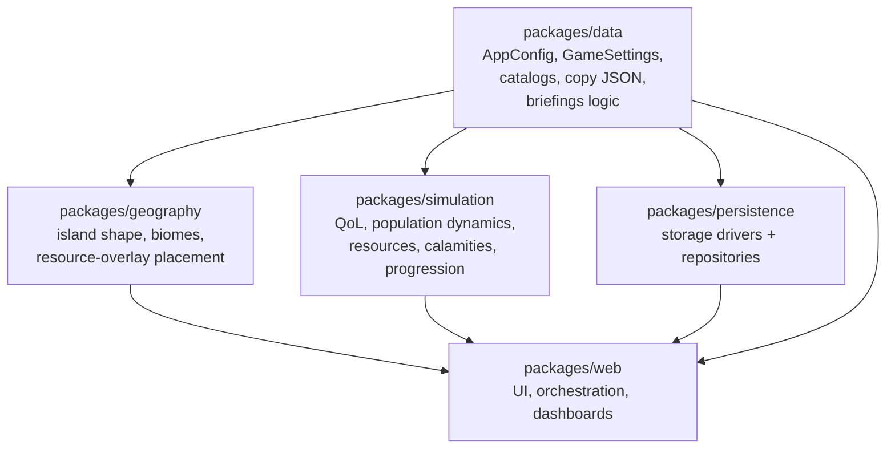

# Monorepo layout

## Root directories

| Path | Contents |
| --- | --- |
| `constitution/` | Product intent and agent guidance |
| `research/` | Sourced demographic, quality-of-life, and resource/geography reference notes |
| `packages/web/` | React + vite app (UI + orchestration; consumes `data` + `simulation` + `geography` + `persistence`). Layout: `pages`/`components`/`context` (UI), `game` (run loop), `models` (citizens), `lib` (helpers + data shims), `repos` (persistence adapters), `workers`/`audio` |
| `packages/simulation/` | Pure TypeScript calculation engine — no React, no I/O |
| `packages/geography/` | Pure, deterministic (seeded) world generation — island shape, biomes, resource overlays, adjacency — no React, no I/O |
| `packages/data/` | Shared config (`AppConfig`, `GameSettings`), research-backed catalogs, briefing/mandate **logic**, and editable **copy JSON** (`src/copy/`) — no React |
| `packages/persistence/` | Storage drivers (IndexedDB default) and typed repositories — no React |
| `packages/desktop/` | Tauri desktop distribution |
| `scripts/` | Cross-package automation |

`packages/data`, `packages/simulation`, `packages/geography`, and
`packages/persistence` have no build step — they're consumed directly as
TypeScript source via Bun workspace links (`workspace:*` dependencies), and
Vite/`tsc` resolve them through each package's `main`/`types` entry
(`./src/index.ts`).

### Creative copy (`packages/data/src/copy/`)

Player-facing strings (dialog, titles, hints, How to rule tips, mandate labels,
calamity names) live under `packages/data/src/copy/` (aides / weekly / mandates /
calamities folders), documented in
[`packages/data/src/copy/README.md`](../packages/data/src/copy/README.md).
TypeScript under `briefings/` and `progression/` owns ids, weights, and
effects, then merges copy by id at import time. Calamity **mechanics** stay in
`packages/data/src/calamities/catalog/`; flavor text merges from `copy/calamities/`.

### Calendar conventions (gameplay)

| Unit | Length | Notes |
| --- | --- | --- |
| Day | 1 | Cohort QoL tick; optional calamity / interrupt |
| Week | 7 days | Weekly region report boundary |
| Month | 28 days | Calamity floor (`guaranteedOnsetIntervalDays: 28`); aide proposals on 1-based month-days 14 & 28 |
| Year | 364 days | Annual cycle + year review (`GameSettings.calendar.daysPerYear` = 364; 13 months) |

## Root scripts

| Command | Action |
| --- | --- |
| `bun install` | Install dependencies (also links workspace packages) |
| `bun run dev` | Web dev server |
| `bun run build` | Web build → copy to desktop → desktop build |
| `bun run lint:fix` | Biome check --write across packages |
| `bun run typecheck` | `tsc --noEmit` across packages that define it |
| `bun run test` | `vitest run` across packages that define it |

Each package under `packages/*` mirrors this same script set (`format`,
`lint`, `lint:fix`, `typecheck`, `test`) where applicable — the root scripts
just fan out via `bun run --filter './packages/*' --if-present <script>`.
