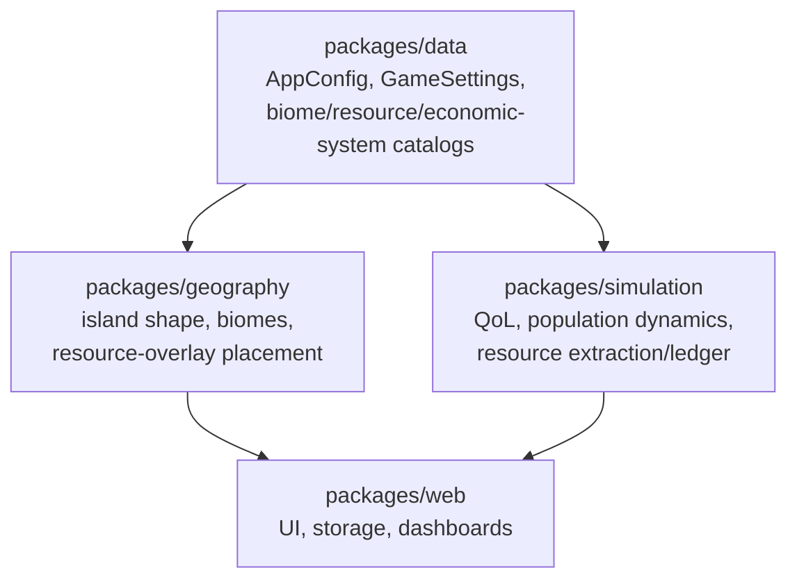

# Monorepo layout

## Root directories

| Path | Contents |
| --- | --- |
| `constitution/` | Product intent and agent guidance |
| `research/` | Sourced demographic, quality-of-life, and resource/geography reference notes |
| `packages/web/` | React + vite app (UI only; consumes `data` + `simulation` + `geography`) |
| `packages/simulation/` | Pure TypeScript calculation engine — no React, no I/O |
| `packages/geography/` | Pure, deterministic (seeded) world generation — island shape, biomes, resource overlays, adjacency — no React, no I/O |
| `packages/data/` | Shared config (`AppConfig`, `GameSettings`) and research-backed reference data — no React |
| `packages/desktop/` | neutralino desktop distribution |
| `scripts/` | Cross-package automation |

`packages/data`, `packages/simulation`, and `packages/geography` have no
build step — they're consumed directly as TypeScript source via Bun
workspace links (`workspace:*` dependencies), and Vite/`tsc` resolve them
through each package's `main`/`types` entry (`./src/index.ts`).

## Root scripts

| Command | Action |
| --- | --- |
| `bun install` | Install dependencies (also links workspace packages) |
| `bun run dev` | Web dev server |
| `bun run build` | Web build → copy to desktop → desktop build |
| `bun run lint:fix` | Biome check --write across packages |
| `bun run typecheck` | `tsc --noEmit` across packages that define it |
| `bun run test` | `vitest run` across packages that define it |

Each package under `packages/*` mirrors this same script set (`format`,
`lint`, `lint:fix`, `typecheck`, `test`) where applicable — the root scripts
just fan out via `bun run --filter './packages/*' --if-present <script>`.
