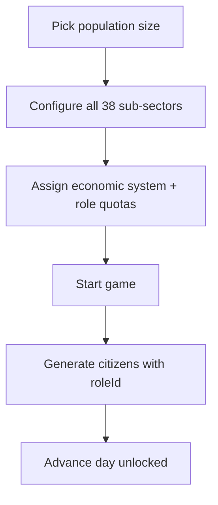
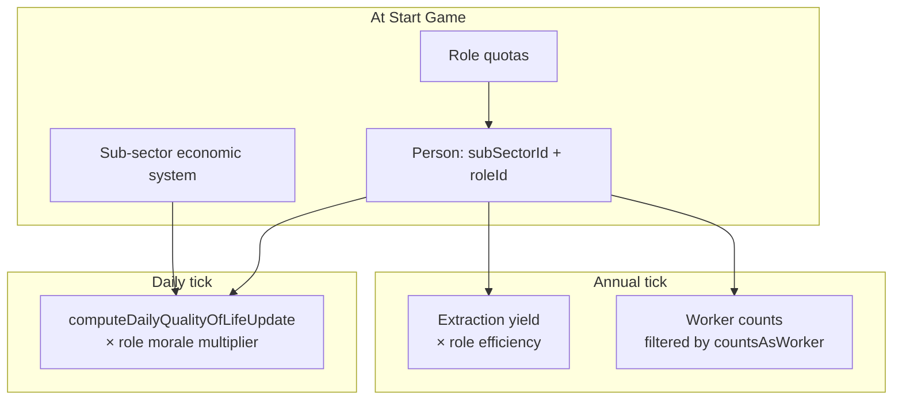

# Economic roles

Research-backed role catalogs for each assignable economic system. Citizens receive a numeric `roleId` (e.g. feudal **serf = 65**) at game start based on per-sub-sector quotas configured by the monarch.

## Authority

1. Historical role definitions trace to [`packages/web/public/economic-systems.md`](../packages/web/public/economic-systems.md).
2. Typed catalogs and effect tables live in [`packages/data/src/economy/economic-roles.ts`](../packages/data/src/economy/economic-roles.ts) and [`role-effects.ts`](../packages/data/src/economy/role-effects.ts).
3. Magnitudes are v1 balancing choices (same spirit as `economic-system-effects.ts`), not empirical estimates.

## Setup flow

## Role effect pipeline

## Stacking rules

- **Morale:** `effectiveMorale = systemMorale × roleMorale` (multiplicative on personality-sector affinity delta).
- **Extraction:** yield uses effective worker units = sum of `efficiencyMultiplier` for citizens with `countsAsWorker: true` in that tile/sub-sector, times system efficiency.

## Role ID ranges

| System | ID range | Example roles |
| --- | --- | --- |
| Capitalism | 10–19 | worker (10), manager (11), owner (12), entrepreneur (13) |
| Socialism | 20–29 | collective worker (20), planner (21), party cadre (22) |
| Tripartism | 30–39 | union worker (30), employer rep (31), government mediator (32) |
| Communism | 40–49 | state worker (40), party official (41), collective chair (42) |
| Mixed economy | 50–59 | private worker (50), public worker (51), regulator (52) |
| Feudalism | 60–69 | **serf (65)**, knight (66), lord (67), clergy (68) |
| Mercantilism | 70–79 | merchant (70), artisan (71), crown agent (72) |
| Market socialism | 80–89 | cooperative worker (80), market manager (81), social planner (82) |
| State capitalism | 90–99 | state enterprise worker (90), bureaucrat (91), party executive (92) |
| Anarcho-capitalism | 100–109 | contractor (100), proprietor (101), investor (102) |
| Subsistence | 110–119 | subsistence farmer (110), hunter-gatherer (111), elder (112) |

## Default quotas (feudalism example)

| Role | Share | Rationale |
| --- | --- | --- |
| Serf | 85% | Majority agrarian labor bound to land |
| Knight | 10% | Military vassal class |
| Lord | 4% | Landholding elite |
| Clergy | 1% | Religious authority |

## Non-working-age citizens

Children and retirees receive `roleId: null` in v1; only working-age citizens are assigned roles from quotas.

## Auto-assign

`buildAutoAssignments()` and `defaultRoleQuotasBySystem` in `packages/data` provide one-click configuration. Primary/extractive sectors default to feudalism or subsistence; modern tiers default to capitalism or mixed economy (see `default-sector-systems.ts`).
