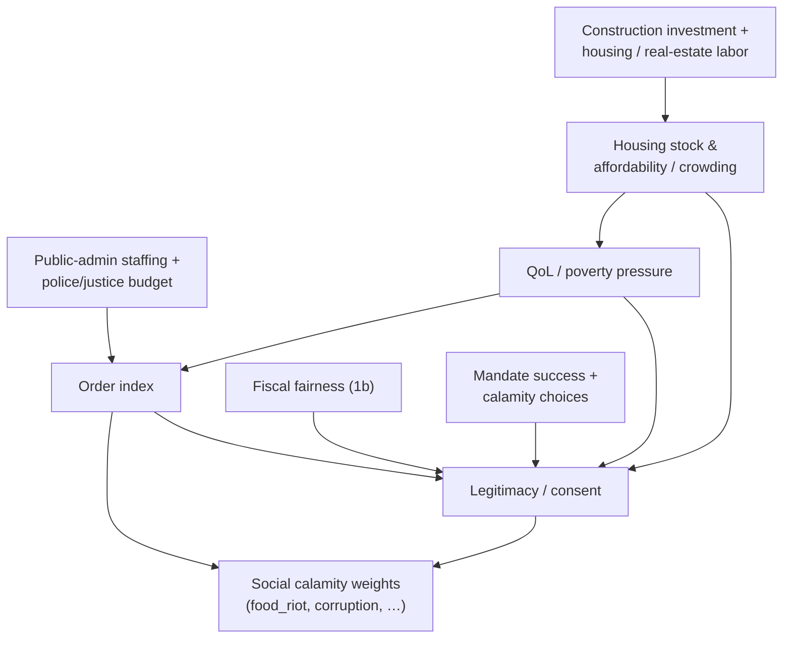

# Housing, internal order & domestic politics

Sourced design rules for **Phase 2** of the
[nation-management roadmap](../.cursor/plans/nation_management_roadmap_a1b2c3d4.plan.md):
making neglect feel political at home. Builds on Phase 1 money/capital/services
and feeds social-calamity weights, emigration, and (later) score.

> **Implementation note:** when coding Phase 2 (todos `phase-2a`–`phase-2c`),
> reference this document for baselines and channels. Keep monarchy fantasy
> compatible — legitimacy does **not** require elections.

## Authority

1. OECD / UN-Habitat housing indicators, World Bank Worldwide Governance
   Indicators (WGI), Weberian legitimacy theory, and procedural-justice /
   policing-by-consent research ground *direction*.
2. Magnitudes are future `GameSettings`.
3. Roadmap owns staging; this doc owns research rationale.

---

## 1. Housing stock & affordability (Phase 2a)

### 1.1 What “adequate housing” means in data

**Sources:**

- UN-Habitat / SDG 11.1.1 metadata — **inadequate housing / affordability**:
  household housing cost **&gt; 30% of income** is the common unaffordability
  threshold used in Urban Indicators work; slum/informal criteria overlap on
  durability, space, water, sanitation, tenure.
- OECD Affordable Housing Database — indicators span housing stock &
  construction, prices/tenures, **costs over income**, overcrowding, and
  homelessness; **housing overburden** often uses **40% of disposable
  income** (Eurostat/OECD).
- OECD Statistics Working Paper *Home Sweet Home* — residential satisfaction
  links strongly to dwelling and neighbourhood features; socio-demographics
  matter less once housing quality is controlled; housing is core to
  material well-being and health.
- UNSD primer on international housing statistics — affordability crises,
  overcrowding, and quality gaps are global; overcrowding strains
  infrastructure and health.

### 1.2 Design implications

| Rule | Research motivation | Suggested mechanic |
| --- | --- | --- |
| Housing stock grows via construction investment + construction/real-estate labor | OECD stock & construction indicators | Regional stock vs population → crowding ratio |
| Crowding / unaffordability → regional happiness penalties + emigration | Well-being & inadequate-housing evidence; migration pressure | Extend existing emigration QoL channel |
| Tie to infrastructure (1a) and fiscal housing/public-works spend (1b) | Neighbourhood services + amenities | Infra multiplies effective housing quality |

**Non-goals:** individual mortgage simulation; player zoning every hex.

### 1.3 Tunable landmarks

| Concept | Real-world landmark | Game use |
| --- | --- | --- |
| Cost burden | 30% income (UN-Habitat); 40% overburden (OECD/Eurostat) | Map “affordability stress” bands once a wage/rent proxy exists — or use crowding-only until fiscal wages exist |
| Crowding | Rooms-per-person / household composition rules (OECD); UN-Habitat often uses &gt;3 people per habitable room in slum criteria | `population / housingStock` vs target occupancy |

Prefer **crowding + underbuilding** as the v1 pair if rents are not yet
simulated; add affordability when Phase 1b wages/taxes make “income” meaningful.

---

## 2. Internal order — crime, police, justice (Phase 2b)

### 2.1 Order as governance, not agent-based crime

**Sources:**

- World Bank **Worldwide Governance Indicators (WGI)** — six dimensions;
  **Rule of Law** captures confidence in rules of society: contract
  enforcement, property rights, **police and courts**, and the **likelihood
  of crime and violence**. **Control of Corruption** and **Political
  Stability / Absence of Violence** are sibling aggregates
  ([WGI](https://www.worldbank.org/en/publication/worldwide-governance-indicators)).
- Tyler / “policing by consent” research tradition (UK ESS analyses, LSE
  summaries) — perceived **legitimacy** and procedural fairness predict
  compliance and cooperation **more strongly than deterrent risk alone**.
- Roadmap constraint: **no individual crime simulation** — regional
  aggregates only (matches WGI’s perception/aggregate spirit better than
  microsim).

### 2.2 Design implications

| Rule | Research motivation | Suggested mechanic |
| --- | --- | --- |
| Order index from public-admin staffing + police/justice budget + QoL/poverty pressure | RL / GE governance inputs; poverty→crime pressure stylized | 0–100 regional or national order |
| Low order → happiness hit, mild efficiency drag, higher social-calamity weights | Crime/violence as obstacle; unrest calamities | Feed `food_riot`, `plague_of_corruption`, etc. |
| Funding raises order with diminishing returns; neglect decays it | Spending ≠ automatic legitimacy | Concave budget response; legitimacy (2c) amplifies effectiveness |

**Non-goals:** street-level crime agents; carceral micromanagement; copying WGI’s
full six-indicator bureaucracy into the HUD.

---

## 3. Domestic politics — legitimacy & pressure (Phase 2c)

### 3.1 Legitimacy without mandatory elections

The game is a **monarchy fantasy**. That is compatible with social science:

**Sources:**

- Max Weber’s types of legitimate authority — **traditional** (custom /
  hereditary), **charismatic**, and **rational-legal**. Monarchy leans on
  traditional (+ occasional charismatic) legitimacy; performance still
  matters for stability
  ([Stanford Encyclopedia: Political Legitimacy](https://plato.stanford.edu/archives/fall2010/entries/legitimacy/)).
- Weber (descriptive): regimes are “legitimate” when subjects hold a belief
  (*Legitimitätsglaube*) that obedience is appropriate — producing more
  stable regularities than pure coercion or habit.
- Beetham / modern critics — belief alone is thin; justification and
  performance also matter for durable authority (useful caution: show
  players *why* consent falls).
- WGI **Voice & Accountability**, **Government Effectiveness**, **Control of
  Corruption** — even without elections, service quality and corruption
  shape perceived authority.
- Police legitimacy literature — fair process sustains voluntary compliance;
  translated to throne scale: calamity responses and aide fairness should
  move legitimacy, not only raw order.

### 3.2 Design implications

| Rule | Research motivation | Suggested mechanic |
| --- | --- | --- |
| Legitimacy / consent meter | Weberian descriptive legitimacy + performance | 0–100 national meter |
| Drivers: QoL, fiscal fairness, order, mandate success, calamity choices | Performance + traditional baseline | Weighted sum / lags; economic-system flavor shifts weights |
| Legislature & Judiciary / Executive Government staffing + aide outcomes nudge legitimacy | Rational-legal capacity inside a monarchy | Quinary sectors become mechanical |
| Low legitimacy amplifies social calamities and hardens weekly/aide menus | Unrest when consent fails | Fewer “good” options; higher riot/corruption weights |
| Corruption as slow drain reducible by funding + admin/command role reforms | WGI Control of Corruption | Drain vs reform spend |

**Non-goals unless reopened:** mandatory elections; multiparty vote share
sim; full constitutional crisis tree.

---

## 4. What is sourced vs designed

| Element | Status |
| --- | --- |
| 30% / 40% housing-cost landmarks; crowding as adequacy | Sourced (UN-Habitat, OECD) |
| Housing quality → well-being | Sourced (OECD residential satisfaction) |
| Rule of law / crime / police as governance aggregate | Sourced (WGI RL) |
| Legitimacy sustains compliance better than fear alone | Sourced (procedural justice / consent policing) |
| Traditional authority fits monarchy fantasy | Sourced (Weber) |
| Single order index + single legitimacy meter | **Designed** |
| No microsim crime | **Designed** (roadmap) |
| Exact weights into calamity catalogs | **Designed** |

---

## Where this will live in code (expected)

| Concern | Package |
| --- | --- |
| Housing / order / legitimacy tunables | `packages/data` |
| Annual/regional aggregate ticks | `packages/simulation` |
| Country overview meters; region inspector housing | `packages/web` |
| Persisted indices | `packages/persistence` |
| Aide / weekly copy reflecting political pressure | `packages/data/src/copy/` |
