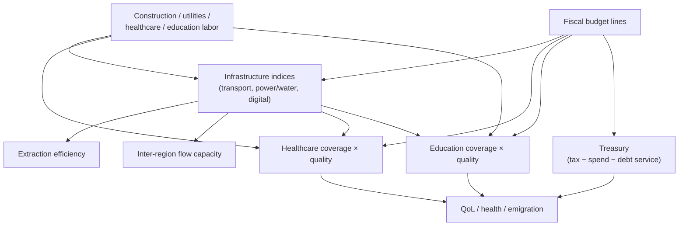

# Infrastructure, fiscal core & public services

Sourced design rules for **Phase 1** of the
[nation-management roadmap](../.cursor/plans/nation_management_roadmap_a1b2c3d4.plan.md):
turning Construction / Utilities / Telecom, taxation, Healthcare, and
Education from employment labels into load-bearing gameplay. Companion
reference flavor lives in
[`packages/web/public/economic-sectors.md`](../packages/web/public/economic-sectors.md)
(`capitalStock`, service access coverage, R&D/GDP) — this document is the
**research authority** those ideas should cite when implemented.

> **Implementation note:** when coding Phase 1 (todos `phase-1a`–`phase-1c`),
> read this doc first. Directions and baselines come from cited sources;
> magnitudes go in `GameSettings`.

## Authority

1. IMF / World Bank public-capital literature, OECD revenue & COFOG spending
   data, WHO UHC monitoring, and Hanushek–Woessmann education-quality work
   ground *direction*.
2. In-game curves are `GameSettings` once Phase 1 ships.
3. Staging and non-goals (no full monetary policy in 1b) remain in the roadmap
   plan.

---

## 1. Infrastructure capital stock (Phase 1a)

### 1.1 Public capital as an input

**Sources:**

- Aschauer, D.A. (1989). *Is public expenditure productive?* Journal of
  Monetary Economics — seminal claim that public capital enters the
  production function with a large output elasticity (early estimates ~0.3);
  later work revised magnitudes downward but kept the qualitative channel.
- World Bank (1994). *World Development Report: Infrastructure for
  Development* — infrastructure as the “wheels” of economic activity
  (telecom, power, water, transport as near-universal intermediate inputs);
  investment alone is **not** sufficient for sustained growth.
- Gupta, Kangur, Papageorgiou & Wane / IMF tradition on
  **efficiency-adjusted public capital** — output elasticity of public capital
  often cited around **~0.15** on average for lower-income samples; returns
  depend on investment *efficiency* (project selection, management), not just
  spending.
- Warner, A.M. (IMF WP 14/148, 2014). *Public Investment as an Engine of
  Growth* — big public-investment drives show only a **weak average**
  growth association; quality and context matter.
- World Bank, *Revisiting Public Investment Multipliers* — multipliers are
  larger when the initial public-capital stock is **scarce** (~1.7% GDP
  medium-term response to 1% of GDP investment) and smaller / insignificant
  when the stock is already high (~0.9%, diminishing returns).

### 1.2 Design implications

| Rule | Research motivation | Suggested mechanic |
| --- | --- | --- |
| Nation (+ optional regional) indices: transport, power/water, digital | Distinct intermediate-input families in WDR / IO tables | 0–100 indices, not a single blob |
| Construction & utilities labor + fiscal investment raise indices | Public capital accumulates from investment | Annual accumulation with depreciation / neglect decay |
| Calamities (`power_outage`, `bridge_collapse`, quakes) lower indices | Real capital stock is shock-vulnerable | Rebuild response restores faster |
| Indices multiply extraction, inter-region flows (0d), service delivery (1c) | Public capital as production / distribution input | Multipliers on existing channels — no parallel win condition |
| Diminishing returns as indices approach ceiling | Empirical multipliers fall when stock is high | Concave response to investment |

**Player levers:** budget line (1b), labor edicts into construction/utilities,
Rebuild calamity response.

**Non-goal:** modeling every bridge as an entity — indices only.

---

## 2. Fiscal core (Phase 1b)

### 2.1 How large is “government”?

**Sources:**

- OECD *Revenue Statistics 2024* — OECD average **tax-to-GDP ≈ 33.9%** in
  2023 (range roughly **18% Mexico – 44% France**). Useful as the “high-
  capacity state” end of the band.
- Gaspar, Jaramillo & Wingender / World Bank follow-ons on a
  **~15% of GDP tax-revenue threshold** — below roughly this band, states
  struggle to fund basic services and cross into higher-income trajectories;
  “Taxing for Growth” revisits the threshold and links higher revenue to
  future health/education spending.
- Our World in Data / OECD COFOG — in OECD countries, **social protection +
  health** often approach about half of spending; indicative 2019–2023 shares
  include health ~**8% of GDP**, education ~**5% of GDP**, general public
  services (incl. debt service) ~**5–6% of GDP**.
- EMDEs spend roughly **~7% of GDP** on health+education combined vs
  **~11%** in advanced economies (World Bank “Taxing for Growth” framing).

### 2.2 Design implications

| Rule | Research motivation | Suggested mechanic |
| --- | --- | --- |
| Annual treasury: tax revenue − spending − debt service | Standard fiscal identity | One balance; soft deficit cap |
| Tax levers (overall bands and/or sector tilts) | Tax-to-GDP is the capacity lever | Higher rates → revenue up, happiness / emigration pressure |
| Budget allocations: infrastructure, healthcare, education, relief reserve; later police / military | COFOG functional split | Player sliders with economic-system default biases |
| Sustained insolvency pressures score + legitimacy (Phase 2) | Weak fiscal states lose capacity and consent | Soft fail cascade, not instant game-over |
| Calamity Relief/Rebuild spend treasury and/or stockpiles | Real emergency fiscal response | Connect 0a hooks |

**Economic systems:** bias *default* tax/spend preferences the player can
override (cosmetic defaults → mechanical priors).

**Non-goals for 1b:** full monetary policy, inflation targeting, central-bank
independence theater (roadmap: Phase 4 or thin Phase 3 add-on).

### 2.3 Illustrative tax / spend bands for tuning

| Band | Tax revenue / “output” | Feel |
| --- | --- | --- |
| Fragile | &lt; ~15% | Cannot fund services; World Bank threshold analogue |
| Developing capacity | ~15–25% | Basic coverage possible |
| Broad OECD-like | ~30–40% | Full domestic service suite + infrastructure |

Exact mapping from game “output” (ledger throughput now; GDP-like later) is a
balance choice.

---

## 3. Public-service policy — healthcare & education (Phase 1c)

### 3.1 Healthcare: coverage and financial protection

**Sources:**

- WHO / World Bank UHC monitoring — SDG 3.8.1 **UHC Service Coverage Index
  (SCI)**: unitless **0–100** geometric mean of 14 tracer indicators across
  RMNCH, infectious disease, NCDs, and service capacity/access. Global SCI
  rose from ~**54 (2000) to ~71 (2023)**; billions still lack essential
  services.
- SDG 3.8.2 — financial hardship from out-of-pocket spending (pair with
  coverage; do not track coverage alone).
- Empirical work linking **domestic health expenditure** to UHC composite
  outcomes (stronger for infectious-disease tracers); education completion
  also predicts better health outcomes as a social determinant.

### 3.2 Education: quality beats years-only

**Sources:**

- Hanushek, E.A., & Woessmann, L. — cognitive skills (“knowledge capital”),
  not mere years of schooling, dominate long-run growth regressions; adding
  test-score measures raises explained growth variance from ~¼ to ~¾ in their
  cross-country work
  ([overview](https://hanushek.stanford.edu/sites/default/files/publications/Hanushek%2BWoessmann%202021%20OxfResEncEcoFin.pdf)).
- Same authors (World Bank PRWP 4122 / book-length summaries) — education
  *quality* relates to earnings, inequality, and growth; attainment without
  learning under-delivers.

### 3.3 Design implications

| Rule | Research motivation | Suggested mechanic |
| --- | --- | --- |
| Separate **coverage** and **quality** for health & education | WHO SCI vs financial hardship; Hanushek quality vs years | Two metrics per service, funded by budget + staffing |
| Healthcare quality reduces disease-calamity severity and raises health floor | Coverage + capacity tracers; expenditure→infectious outcomes | Modify calamity mid-term and daily health set-point |
| Education quality slowly improves personality–job fit **or** productivity | Knowledge-capital channel, kept small | Pick **one** clear channel in v1 of 1c |
| Underfunding → gaps → happiness / health / emigration penalties | UHC gaps + weak fiscal capacity | Stronger in low-infrastructure regions (1a × 1c) |

**Keep the model small:** one health channel and one education channel into
existing QoL / calamity / (later) output systems — resist a second full
simulation of hospitals and schools.

---

## 4. What is sourced vs designed

| Element | Status |
| --- | --- |
| Public capital raises productive capacity; diminishing returns | Sourced (Aschauer → IMF/WB revisions) |
| Efficiency / institutions mediate investment payoff | Sourced (PIMI / efficiency-adjusted capital) |
| ~15% and ~34% tax-to-GDP landmarks | Sourced order-of-magnitude (WB threshold; OECD average) |
| Health & education as major budget functions | Sourced (COFOG / OWID) |
| UHC as 0–100 coverage-style index | Sourced (WHO SCI) |
| Education quality > schooling quantity for growth | Sourced (Hanushek–Woessmann) |
| Three infrastructure indices; exact elasticities | **Designed** |
| Soft deficit cap and monarchy-facing tax UI | **Designed** |
| Single education gameplay channel | **Designed** scope cut |

---

## Where this will live in code (expected)

| Concern | Package |
| --- | --- |
| Policy definitions, tax bands, index tunables | `packages/data` |
| Annual infrastructure / fiscal / service ticks | `packages/simulation` |
| Realm / Treasury dashboard, budget sliders | `packages/web` |
| Treasury + index persistence | `packages/persistence` |
| Instructions / How to rule copy | `packages/data/src/copy/` |
