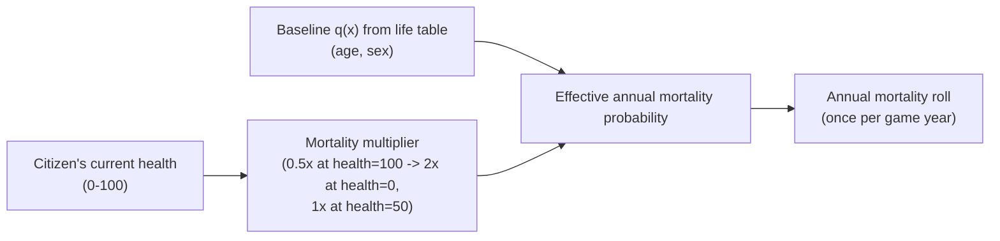

# Life & demographics

Sourced baseline data for how long citizens live and how many children are
born, before any in-game quality-of-life (QoL) modulation is applied. The
typed, code-consumable version of the tables below lives in
[`packages/data/src/demographics/life-tables.ts`](../packages/data/src/demographics/life-tables.ts).

This baseline represents an **average, real-world country** — the simulation
then pushes individual citizens' mortality and fertility odds up or down from
this baseline based on their personal quality of life (see
[quality-of-life-rules.md](./quality-of-life-rules.md) for how QoL itself is
computed).

## Mortality: life table by age and sex

**Source:** U.S. Social Security Administration, Office of the Chief
Actuary, *Period Life Table* (Alternative II / intermediate assumptions),
2024 Trustees Report, calendar year 2022 — the most recent actual (non-
projected) year in that series.
[`PerLifeTables_M_Alt2_TR2024.txt`](https://www.ssa.gov/oact/Downloadables/CY/PerLifeTables_M_Alt2_TR2024.txt) /
[`PerLifeTables_F_Alt2_TR2024.txt`](https://www.ssa.gov/oact/HistEst/PerLifeTables/2024/PerLifeTables_F_Alt2_TR2024.txt).

A period life table gives, for each exact age, the probability that a person
at that age dies before their next birthday (`q(x)`), and their remaining
life expectancy (`e(x)`) if mortality stayed at that year's rates for the
rest of their life. We sample it every 10 years (plus age 0) — enough
resolution for a game-scale mortality curve; the simulation linearly
interpolates between rows for in-between ages (see
`getAnnualMortalityProbability` in `life-tables.ts`).

| Age | Male `q(x)` | Male `e(x)` (yrs left) | Female `q(x)` | Female `e(x)` (yrs left) |
| --- | --- | --- | --- | --- |
| 0 | 0.005950 | 74.78 | 0.005047 | 80.18 |
| 10 | 0.000129 | 65.37 | 0.000112 | 70.71 |
| 20 | 0.001256 | 55.67 | 0.000477 | 60.86 |
| 30 | 0.002323 | 46.53 | 0.000996 | 51.24 |
| 40 | 0.003350 | 37.68 | 0.001819 | 41.85 |
| 50 | 0.005644 | 29.06 | 0.003431 | 32.73 |
| 60 | 0.012489 | 21.09 | 0.007717 | 24.13 |
| 70 | 0.024643 | 14.10 | 0.015836 | 16.29 |
| 80 | 0.060630 | 8.10 | 0.044227 | 9.48 |
| 90 | 0.170715 | 3.91 | 0.137011 | 4.66 |
| 100 | 0.372512 | 2.00 | 0.314247 | 2.37 |
| 110 | 0.606782 | 1.10 | 0.562768 | 1.21 |

Takeaways that inform game balance:

- Women outlive men at every age in this dataset — the female curve should
  produce a visibly higher population share at old age in the age-sex
  pyramid dashboard (Stage 5).
- Mortality is roughly flat and low through working age (10–40), then rises
  steeply (note the log-scale jump from age 60 onward) — a citizen's
  quality of life matters most for whether they survive into old age at all,
  less so for whether a healthy adult in their 20s–30s dies "naturally" in
  any given year.

## Fertility: baseline rate

**Source:** UN Department of Economic and Social Affairs, Population
Division, *World Population Prospects 2024: Summary of Results* — global
total fertility rate (TFR), 2024.

| Metric | Value | Meaning |
| --- | --- | --- |
| Global baseline TFR | **2.25** live births per woman | Average children a woman has over her lifetime at current rates |
| Replacement-level TFR | 2.1 | TFR needed for a population to hold steady long-term without migration |

We treat **2.25** as the *baseline* fertility rate for an average-QoL
country (`GLOBAL_BASELINE_TOTAL_FERTILITY_RATE` in `life-tables.ts`). A
country at replacement level or below is demographically shrinking absent
immigration — useful context for tuning how harshly low QoL should suppress
births in Stage 3.

## How quality of life modulates these baselines (implemented in Stage 3)

The tables above describe an *average* country. Each citizen's actual odds
diverge from that average based on their personal health (mortality) or
happiness (fertility) — see
[quality-of-life-rules.md](./quality-of-life-rules.md) for how those scores
are computed daily. All of this lives in
[`packages/simulation/src/population-dynamics/`](../packages/simulation/src/population-dynamics/)
and runs once per game year, across the whole stored population, via
`runAnnualCycle` in `packages/web/src/storage/population.ts`.

- **Mortality** (`mortality.ts`): `effectiveQx = baselineQx(age, sex) *
  mortalityMultiplier(health)`, where `mortalityMultiplier` is 1.0 at health
  50 (neutral), scales linearly down to 0.5x at health 100, and linearly up
  to 2x at health 0. A citizen suffering from very low health can be twice as
  likely to die at any given age as the sourced baseline; a thriving citizen
  is half as likely to.
- **Fertility** (`fertility.ts`): the global baseline TFR (2.25) is spread
  evenly across the configured childbearing age range (15–49 by default,
  `GameSettings.population.fertility`) into an implied annual per-woman
  birth probability, then scaled by a happiness-based multiplier — 1.0x at
  happiness 50, up to 1.3x at happiness 100, down to 0.5x at happiness 0. A
  thriving nation has above-baseline births; a struggling one falls toward
  (and below) replacement level.
- **Emigration** (`migration.ts`): citizens whose average of happiness and
  health falls below `GameSettings.population.emigration.qolThreshold`
  (default 35) face an annual emigration probability that scales linearly
  from 0 at the threshold up to `maxAnnualProbability` (default 15%) as QoL
  approaches zero. Citizens at or above the threshold never emigrate.
- **Immigration** (`migration.ts`): the expected number of immigrants for
  the year is `currentPopulation * rate`, where `rate` starts at
  `baselineAnnualRate` (default 1%) when the national average QoL
  (population-wide average of happiness and health) sits at
  `neutralQualityOfLife` (default 50), and moves up or down by
  `qolSensitivity` (default 0.05) for every 100 points of QoL above or below
  neutral — a more attractive country draws more immigrants. The fractional
  expected count is resolved with stochastic rounding so the long-run
  average across many years matches exactly.
- Each citizen's outcome for the year is resolved in a fixed order — death,
  then emigration, then fertility (`computeAnnualOutcomeForCitizen` in
  `annual-cycle.ts`) — so a citizen who dies or leaves the country that year
  cannot also give birth in it.
- All multiplier curves are deliberately simplified, monotonic functions of
  health/happiness/QoL for v1 (higher is always better for population
  growth and staying), rather than modeling the real-world "demographic
  transition" effect where very high-development countries also see
  fertility decline for unrelated socioeconomic reasons — noted here as a
  known simplification, not an oversight.

## Related research

- [quality-of-life-rules.md](./quality-of-life-rules.md) — how the QoL score
  referenced above is itself computed from work hours, personality-sector
  fit, and the happiness-health relationship.
