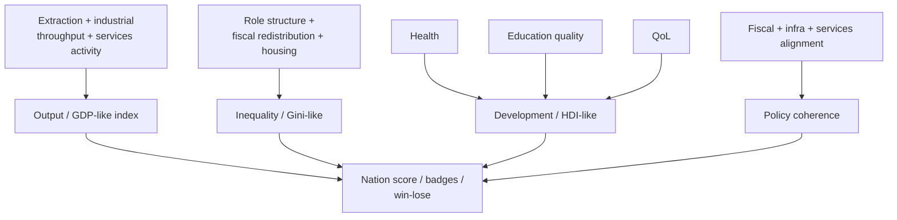

# Macro metrics & score evolution

Sourced design rules for **Phase 4** of the
[nation-management roadmap](../.cursor/plans/nation_management_roadmap_a1b2c3d4.plan.md):
evolving nation score beyond today’s QoL / growth / migration / ledger /
environment blend once Phases 1–2 (and ideally 3a) produce real aggregates.
Also covers thin monetary/inflation add-ons that the roadmap parks here.

> **Implementation note:** when coding Phase 4 (todo `phase-4`) or deferred
> score items from
> [scores_win_lose_badges_9809be54.plan.md](../.cursor/plans/scores_win_lose_badges_9809be54.plan.md),
> use this document for metric definitions. Do **not** invent parallel win
> conditions — fold new metrics into the existing score / badge / legitimacy
> channels.

## Authority

1. National-accounts intuition (GDP as value added), World Bank Gini
   definition, UNDP HDI technical notes, and sector-share development
   patterns in
   [`economic-sectors.md`](../packages/web/public/economic-sectors.md)
   ground *direction*.
2. Score weights remain product/balance choices in `GameSettings` /
   progression code.
3. Scenario modes, multi-save, leaderboards stay post-metric-stabilization
   per the scores plan.

---

## 1. Output / “GDP-like” metric

### 1.1 What GDP is (and is not)

**GDP** measures the market value of final goods and services produced in a
period — equivalently, aggregate **value added**. It is **not** welfare,
equality, or sustainability. The game already has production and demand
fragments (extraction, industrial inputs, employment); Phase 4 should
compose them into one readable output index rather than pretending a full
SNA 2008 implementation.

**Sources / anchors:**

- Standard national accounts (SNA) — production = expenditure = income
  identities in theory; we only need a **production-side** stylization.
- [`economic-sectors.md`](../packages/web/public/economic-sectors.md) —
  typical GDP shares by development stage:

| Sector | Developed GDP share | Developing GDP share |
| --- | --- | --- |
| Primary | 1–3% | 15–40% |
| Secondary | 15–25% | 20–35% |
| Tertiary | 60–75% | 35–55% |
| Quaternary | 5–15% (often inside tertiary stats) | 1–5% |
| Quinary | &lt; 2% | &lt; 2% |

Use these as **sanity checks** for generated economies, not hard targets the
player must hit.

### 1.2 Design implications

| Rule | Research motivation | Suggested mechanic |
| --- | --- | --- |
| Compose extraction + industrial throughput + services activity | Production-side GDP | Weighted throughput index; later include service quality × coverage |
| Replace or supplement ledger-only prosperity in score | Ledger sufficiency ≠ total output | Score line item evolves |
| Do not treat GDP-like as win-alone | GDP ≠ development | Pair with HDI-like / inequality |

---

## 2. Inequality / “Gini-like” metric

### 2.1 Definition

**Sources:**

- World Bank / standard public finance — the **Gini coefficient** measures
  dispersion of income or consumption; **0 = perfect equality**, **1 (or
  100) = perfect inequality**. Often reported on a **0–100** scale in
  databases.
- Role catalogs already encode class structure
  ([economic-roles.md](./economic-roles.md)) — serf/lord vs worker/owner
  quotas are a natural inequality input before true wage distributions exist.

### 2.2 Design implications

| Rule | Research motivation | Suggested mechanic |
| --- | --- | --- |
| Derive inequality from role structure + fiscal redistribution + housing | Gini needs a distribution; roles are our distribution proxy | Pseudo-Gini from role shares × income weights |
| Soft score + legitimacy pressure | High inequality can undermine consent | Feed Phase 2c; avoid hard fail on Gini alone |
| Progressive tax / public services reduce effective inequality | Redistribution channel | 1b/1c policy levers matter |

**Non-goal:** estimating a statistically perfect Lorenz curve from 1M
citizen incomes each year unless sampling makes it cheap.

---

## 3. Development / “HDI-like” metric

### 3.1 UNDP construction

**Sources:**

- UNDP Human Development Reports — HDI is a summary of **health**,
  **education**, and **standard of living**; geometric mean of normalized
  dimension indices so dimensions are not perfect substitutes
  ([HDR technical notes](https://hdr.undp.org/sites/default/files/2023-24_HDR/hdr2023-24_technical_notes.pdf)):

\[
\mathrm{HDI} = (I_{\mathrm{Health}} \cdot I_{\mathrm{Education}} \cdot I_{\mathrm{Income}})^{1/3}
\]

| Dimension | Real indicator (UNDP) | Game proxy |
| --- | --- | --- |
| Health | Life expectancy at birth | Population health / life-table outcomes already in sim |
| Education | Mean + expected years of schooling | Education coverage × quality (Phase 1c) |
| Income / living standard | ln(GNI per capita) | GDP-like per capita or QoL/material composite |

Illustrative UNDP goalposts (2023/24 technical notes): life expectancy
min/max **20 / 85** years; education years **0 / 15** (mean) and **0 / 18**
(expected); GNI per capita **$100 / $75,000** with **log** transform.

### 3.2 Design implications

| Rule | Research motivation | Suggested mechanic |
| --- | --- | --- |
| Geometric mean of three normalized 0–1 pillars | UNDP HDI | Prevents one pillar from fully substituting another |
| Use log-like diminishing returns on material pillar | Anand–Sen / UNDP income transform | Matches “money matters less at the top” |
| Drive win/lose and badges cautiously | HDI is a development lens, not a GDP race | Pair with existing nation score |

---

## 4. Policy coherence (quinary fantasy made measurable)

[`economic-sectors.md`](../packages/web/public/economic-sectors.md) already
lists **policy coherence** as a quinary success weight. Phase 4 can define it
as alignment among fiscal stance, infrastructure investment, and service
outcomes (e.g. high education budget + collapsing schools = incoherence).

| Signal | Coherent | Incoherent |
| --- | --- | --- |
| Infra budget vs construction labor | Both high or intentionally low | Spend without labor (or reverse) for years |
| Health budget vs disease outcomes | Coverage rising | Spend rising, SCI-like coverage flat (waste/corruption) |
| Tax take vs service delivery | Near World Bank capacity bands with matching coverage | High tax, low services → legitimacy hit |

This is mostly **designed** instrumentation on top of Phase 1–2 systems.

---

## 5. Monetary policy / inflation (thin add-on)

Roadmap: full monetary policy waits until fiscal exists; Phase 4 (or thin
Phase 3 add-on) may add:

| Concept | Minimal mechanic | Non-goal |
| --- | --- | --- |
| Inflation | Drift from deficit monetization + demand pressure | Full DSGE / Taylor rule UI |
| Real vs nominal treasury | Simple deflator on cash balances | Central-bank independence sim as core loop |

Only add if score and treasury readability suffer without it.

---

## 6. Score evolution checklist

From the roadmap metric table:

| Metric family | Feeds from | Score use |
| --- | --- | --- |
| Output / GDP-like | Extraction + industry + services | Prosperity line |
| Inequality / Gini-like | Roles + fiscal + housing | Soft score + legitimacy |
| Development / HDI-like | Health, education, QoL/material | Win/lose + badges |
| Policy coherence | Fiscal + infra + services alignment | Quinary measurability |

Eligible after metrics stabilize (scores plan future list): scenario/challenge
modes, multiple save slots, leaderboards.

---

## 7. What is sourced vs designed

| Element | Status |
| --- | --- |
| GDP as value-added / output concept | Sourced (SNA intuition) |
| Sector GDP share sanity bands | Sourced order-of-magnitude (sector reference doc) |
| Gini 0–1 / 0–100 inequality meaning | Sourced (World Bank practice) |
| HDI geometric mean + three pillars + log income | Sourced (UNDP technical notes) |
| Exact score weights and win thresholds | **Designed** |
| Role-based pseudo-Gini | **Designed** approximation |
| Policy coherence formula | **Designed** |

---

## Where this will live in code (expected)

| Concern | Package |
| --- | --- |
| Metric formulas + tunables | `packages/data`, `packages/simulation/src/progression/` |
| Nation score dashboard | `packages/web` |
| Career badges / profile | `packages/persistence` (existing scores plan storage split) |
