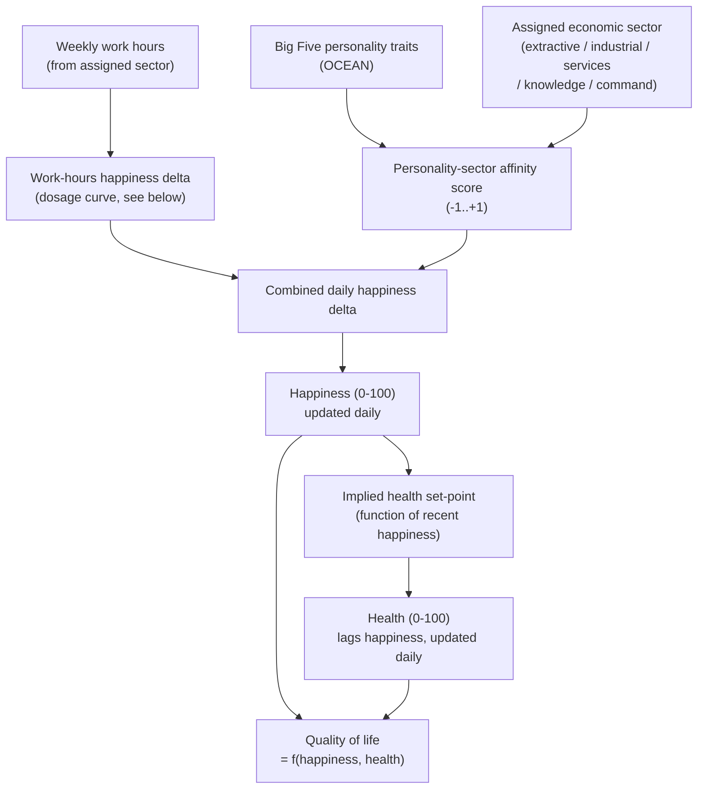
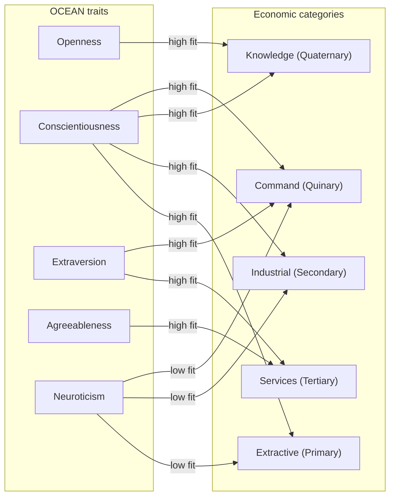

# Quality-of-life rules ("life rules")

How a single citizen's day-to-day **quality of life (QoL)** — the thing that
ultimately drives the mortality/fertility/migration modulation described in
[life-and-demographics.md](./life-and-demographics.md) — is computed from
their job and their personality. QoL is composed of two 0–100 scores already
on the `Person` model: **happiness** and **health**.



This pipeline runs once per in-game day for 1/7th of the population (the
existing cohort cycle — see [`_monorepo.md`](../constitution/_monorepo.md)),
implemented as pure functions in `packages/simulation` (Stage 2).

## 1. Work-hours happiness penalty (a "dosage" curve, not a linear one)

**Source:** Chandola, T., Booker, C.L., Kan, M., & Benzeval, M. (2019). *A
shorter working week for everyone: How much paid work is needed for mental
health and well-being?* Social Science & Medicine.
([summary](https://www.cam.ac.uk/stories/employment-dosage)) — a fixed-effects
analysis of ~71,000 UK residents (2009–2018).

The key finding: going from **zero hours to any paid work (even ≤8
hrs/week)** produces the single biggest wellbeing jump (~30% lower risk of
mental health problems); there is then **little further wellbeing
difference** across the whole range from part-time up to a standard full-time
week (37–48 hrs). Separately, general overtime/burnout research supports a
penalty once hours climb meaningfully past the historical
[ILO 48-hour standard](https://www.ilo.org/) work week.

This gives a "dosage" curve rather than a straight line — modeled as three
zones (exact breakpoints and magnitudes are `GameSettings` tunables, set
here as the v1 defaults):

| Weekly hours | Zone | Daily happiness delta |
| --- | --- | --- |
| 0 (working-age, unemployed) | Idle | Strong penalty (loses the "employment dosage" benefit) |
| 1–48 | Neutral | ~No penalty — flat per the Cambridge/Salford finding |
| 48+ | Overwork | Escalating penalty, growing faster the further above 48 |

## 2. Personality-to-sector affinity (OCEAN model)

**Sources:**

- Barrick, M.R., & Mount, M.K. (1991). *The Big Five personality dimensions
  and job performance: a meta-analysis.* Personnel Psychology — conscientiousness
  predicts performance across nearly all occupation types; other traits are
  more predictive for specific occupation families.
- Larson, L.M., Rottinghaus, P.J., & Borgen, F.H. (2002). *Meta-analyses of
  Big Six interests and Big Five personality factors.* Journal of Vocational
  Behavior — maps Big Five traits onto Holland's RIASEC vocational-interest
  types (Realistic, Investigative, Artistic, Social, Enterprising,
  Conventional), which correspond loosely to our five economic categories.

Each of the game's five economic categories (see
[`taxonomy.ts`](../packages/web/src/data/taxonomy.ts)) has an "ideal"
personality profile. A citizen's alignment with their assigned sector is a
similarity score between their own OCEAN traits and that profile, mapped to
`-1..+1` and then into a happiness delta (well-aligned → bonus,
mismatched → penalty).



Qualitative ideal profiles used to seed the Stage 2 affinity model:

| Category | High | Low |
| --- | --- | --- |
| Extractive (Primary) | Conscientiousness | Neuroticism |
| Industrial (Secondary) | Conscientiousness | Neuroticism |
| Services (Tertiary) | Extraversion, Agreeableness | — |
| Knowledge (Quaternary) | Openness, Conscientiousness | — |
| Command (Quinary) | Extraversion, Conscientiousness | Neuroticism |

Traits not listed for a category are treated as roughly neutral (low
weight) rather than actively penalized — most sectors don't strongly select
against a trait, they just don't reward it either.

## 3. Health follows happiness, with a lag

**Source:** Diener, E., & Chan, M.Y. (2011). *Happy people live longer:
Subjective well-being contributes to health and longevity.* Applied
Psychology: Health and Well-Being — a meta-analytic review establishing that
subjective wellbeing predicts physical health outcomes over time (not
instantaneously).

Rather than coupling health 1:1 to happiness, health drifts toward a
happiness-derived target with inertia — sustained low happiness erodes
health gradually, and a bad day doesn't crash someone's health, matching the
"contributes to... over time" framing of the source:

```
healthTarget = f(recentHappiness)          // e.g. happiness itself, or a smoothed average
health(t+1)  = health(t) + healthLagRate * (healthTarget - health(t))
```

`healthLagRate` is small (illustrative default: 0.02–0.05 per day) and is a
`GameSettings` tunable, not hard-coded — this is the knob that controls how
many in-game days of poor happiness it takes before health visibly
declines.

## 4. Quality of life score

QoL itself (the number that feeds the mortality/fertility/migration
modulation in [life-and-demographics.md](./life-and-demographics.md)) is a
combination of the two, defaulting to a simple average unless play-testing
shows one should be weighted more heavily:

```
qol = (happiness + health) / 2
```

## What's implemented vs. what's still a research proposal

This document defines the **model and its sourcing**; the exact
breakpoints, weights, and multiplier curves above are v1 defaults meant to
be tuned. Stage 2 implements the work-hours and personality-affinity pieces
as pure functions in `packages/simulation`, reading their tunables from
`GameSettings`. Stage 3 implements the health/QoL feed into the
mortality/fertility/migration rolls described in
[life-and-demographics.md](./life-and-demographics.md).
