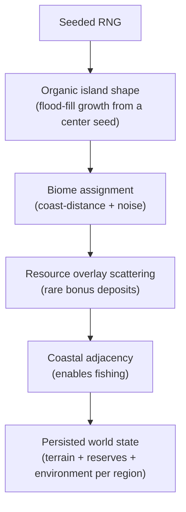
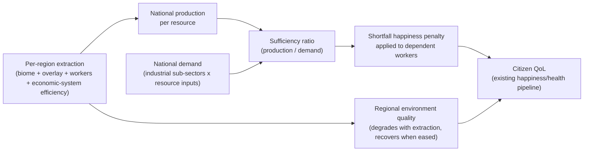
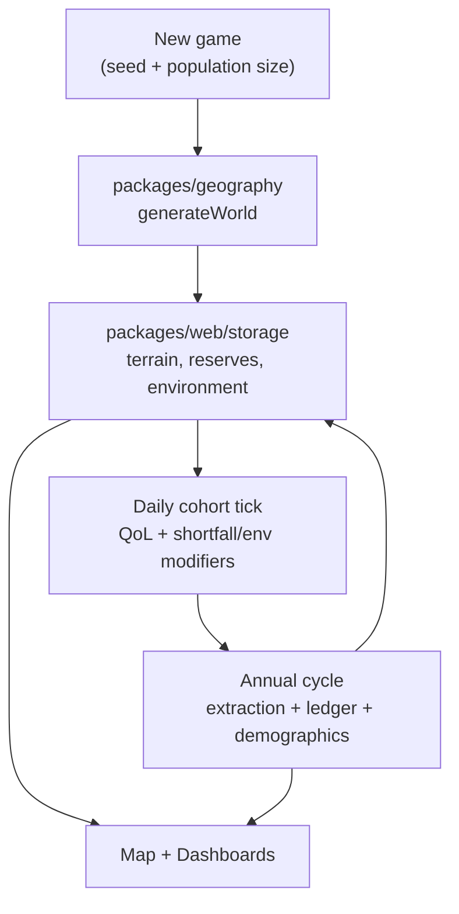

# Resources and geography

How the country's island is procedurally generated, how its land is turned
into biomes and bonus resource deposits, and how extracting those resources
feeds a national resource ledger, degrades the land, and affects citizen
quality of life (QoL). This is the research and design doc behind the
**Island Resources and Terrain** update — see
[`_monorepo.md`](../constitution/_monorepo.md) for the new package boundary
(`packages/geography`) and [quality-of-life-rules.md](./quality-of-life-rules.md)
for how the existing daily QoL pipeline is extended with an environmental
modifier.

## 1. Island generation approach

**Goal (confirmed with the player):** a single contiguous island, organic and
irregular in shape, fully surrounded by ocean, different every game.

**Approach:** grow the island on a larger *bounding* hex grid
(`AppConfig.regions.boundingRadius`, or the radius chosen at new-game
setup via Few / Medium / More — default **More** = radius 5 ≈ 91 tiles)
rather than making every hex in the grid land (the old fixed-hexagon map).

| Province scale | `boundingRadius` | ~tiles / ~land (55%) |
| --- | --- | --- |
| Few | 3 | 37 / ~20 |
| Medium | 4 | 61 / ~34 |
| More (default) | 5 | 91 / ~50 |

A seeded pseudo-random generator:

1. Picks a starting hex near the center of the bounding grid.
2. Grows the landmass outward one ring of adjacency at a time (a bounded
   flood-fill / random walk hybrid: each land tile's unclaimed neighbors have
   a probability of becoming land that falls off with distance from the
   center and is perturbed by seeded noise), until the target land-tile
   count (`boundingRadius` grid size × `AppConfig.regions.targetLandRatio`) is
   reached or growth stalls.
3. Verifies single-landmass contiguity (a flood-fill connectivity check from
   the seed tile must reach every land tile) — if growth ever produces a
   disconnected pocket, that pocket is re-absorbed into ocean before the
   result is accepted.
4. Everything not claimed as land is ocean.

This is a standard, well-understood procedural-generation technique
(cellular-automaton / flood-fill island growth is widely used in strategy
game map generators); no academic citation applies here since it is a game-
design/algorithmic choice, not a modeled real-world process. Determinism
(same seed → same island) makes this heavily unit-testable — see stage 2 of
the plan.

## 2. Biome model

Every **land** tile gets exactly one biome, chosen from a coast-distance and
noise-driven assignment (tiles near the generated coastline skew toward
`wetland`/`plains`; interior tiles skew toward `hills`/`mountains`/`forest`;
`desert` appears as pockets, same "occasional bad tile" role the `desert`
resource plays in *Catan*). `ocean` is not a biome — it carries no resource
yields and exists only as the sea surrounding (and, structurally, never
inside) the island.

| Biome | Enables (extractive sub-sector) | Notes |
| --- | --- | --- |
| Plains | Agriculture (strong), Livestock (weak) | The default, generalist farmland tile |
| Pasture | Livestock (strong), Agriculture (weak) | Best grazing land |
| Forest | Forestry | |
| Hills | Quarrying, Mining — Metals (weak) | |
| Mountains | Mining — Metals (strong), Mining — Energy, Quarrying (weak) | Best mineral/fuel yields, highest environmental cost |
| Wetland | Agriculture (moderate) | Fertile but awkward to work |
| Desert | None directly | The "bad tile" — unless a Fossil Fuel Field overlay lands on it |
| *any coastal land tile* | Fishing & Aquaculture | Not biome-gated — any land tile adjacent to ≥1 ocean tile is fishable, matching the plan's "any coastal land tile" rule |

**Terrain degradation (a visible, mechanical scar):** sustained
over-extraction or (for finite resources) full depletion flips a tile's
biome to a degraded end-state: vegetation/soil-based biomes (`plains`,
`pasture`, `forest`, `wetland`) degrade to **Cleared Land** (a small residual
crop yield survives); mineral biomes (`hills`, `mountains`) degrade to
**Barren Rock** (nothing left). `desert` and the two degraded biomes
themselves have no further degradation path — they're already the floor.
The exact trigger thresholds are `GameSettings.resources` tunables (see §5).

## 3. Resources: renewable vs. finite

Every extractive sub-sector in
[`taxonomy.ts`](../packages/data/src/economy/taxonomy.ts) maps to exactly one
tradeable resource (`packages/data/src/geography/resources.ts`):

| Resource | Sub-sector | Renewable? |
| --- | --- | --- |
| Crops | Agriculture | Yes |
| Livestock | Livestock & Dairy | Yes |
| Timber | Forestry | Yes |
| Fish | Fishing & Aquaculture | Yes |
| Metal Ore | Mining — Metals | No |
| Fossil Fuels | Mining — Energy | No |
| Stone | Quarrying | No |

This is deliberately closer to *Civilization*'s richer terrain-plus-resource
model than *Catan*'s one-resource-per-tile abstraction (per the confirmed
scope): a tile's **biome** decides which sub-sectors can be worked there at
all (and its yield), independent of whether it also carries a rarer **bonus
overlay** (below).

**Renewable resources** (crops, livestock, timber, fish) regenerate each
year toward a full carrying capacity, and only lose long-term capacity if
extraction is sustained above a threshold ("over-extraction") for multiple
years — a simplified stand-in for real renewable-resource dynamics (e.g.
overfishing collapsing a fish stock, or overgrazing causing desertification).

**Finite resources** (metal ore, fossil fuels, stone) have a fixed regional
reserve that only ever shrinks. Yield tapers as reserves run low (a
diminishing-returns floor, not a cliff) and hits zero at exhaustion, at which
point the tile is eligible to flip to `barrenRock`.

## 4. Bonus resource overlays

Rarer than the base biome yield, at most one per tile
(`packages/data/src/geography/resource-overlays.ts`):

| Overlay | Eligible biomes | Effect |
| --- | --- | --- |
| Fresh Water Spring | Plains, Pasture, Forest, Wetland, Hills | Crop/livestock yield bonus **and** a flat regional environment-quality bonus |
| Rich Ore Vein | Hills, Mountains | Large metal ore yield bonus |
| Fossil Fuel Field | Mountains, Hills, **Desert** | Large fossil fuel yield bonus |
| Fertile Soil | Plains, Wetland, Pasture | Crop/livestock yield bonus |

**Guarantee:** every generated island places **at least one** of each catalog
overlay, each on its **own** tile. If no free eligible biome remains for a
type (e.g. a tiny Few-province map with a single hills hex already taken by
Rich Ore), the placer nudges another land tile's biome into eligibility and
places there. Remaining overlays then scatter up toward
`AppConfig.regions.resourceOverlayRatio`. A ratio of `0` disables overlays
entirely (tests / special cases).

Fresh water is intentionally **not** one of the seven national-ledger
resources. Unlike ore or timber, it isn't stockpiled or shipped between
sectors in this model — it acts locally, which is why it's modeled as a
per-region overlay effect (yield bonus + a direct regional
environment-quality/livability bonus) rather than a tradeable commodity. This
keeps it "foundational" (per the confirmed scope) without forcing an eighth
ledger resource with no natural national demand curve.

Placing a Fossil Fuel Field overlay on `desert` is deliberate: real deserts
(the Arabian Peninsula being the canonical example) often sit on major oil
and gas reserves despite barren surface terrain — this gives the "bad tile"
a plausible, occasional high-value exception, adding strategic tension
(develop the desert's fuel field at an environmental cost vs. leave it be).

## 5. Extraction, depletion, and environmental degradation model

**What's genuinely sourced vs. what's a designed game model:** the
*direction* of the environmental-degradation and economic-system-effect
relationships below is grounded in real literature (cited per section). The
*exact numbers* (yield-per-worker, depletion rates, degradation thresholds,
multiplier magnitudes) are a **designed v1 balance**, not measured from any
dataset — consistent with the existing "v1 simplification" precedent set by
`taxonomy.ts`'s `employmentWeight` and this doc's sibling
[quality-of-life-rules.md](./quality-of-life-rules.md). All of them are
`GameSettings`/`AppConfig` tunables (`packages/data/src/config/`), not
hard-coded, so they can be rebalanced without touching simulation code.

### 5.1 Extraction pollution and health — sourcing for the environment→QoL link

**Source:** Landrigan, P.J., et al. (2018). *The Lancet Commission on
pollution and health.* The Lancet, 391(10119), 462–512. The Commission
estimates pollution (much of it from industrial extraction, mining, and
fossil-fuel combustion) caused roughly 9 million premature deaths worldwide
in 2015, with the heaviest burden concentrated in and around
extraction/industrial zones in low- and middle-income countries.

This motivates a direct mechanical link in the simulation: a region's
**environment quality** (0–100, degraded by extraction intensity, recovered
when extraction eases — see below) feeds an `environmentalQualityModifier`
into the existing daily QoL pipeline
([quality-of-life-rules.md](./quality-of-life-rules.md)) alongside the
work-hours and personality-affinity deltas already there. Citizens living
near heavily extracted, degraded regions take a happiness/health penalty;
citizens in unspoiled or recovered regions do not.

### 5.2 The national resource ledger — resource curse / Dutch disease framing

**Sources:**

- Sachs, J.D., & Warner, A.M. (2001). *The curse of natural resources.*
  European Economic Review, 45(4–6), 827–838 — the foundational empirical
  finding that resource-abundant economies often grow more slowly than
  resource-poor ones, absent strong institutions to manage the windfall.
- Corden, W.M., & Neary, J.P. (1982). *Booming sector and de-industrialisation
  in a small open economy.* The Economic Journal, 92(368), 825–848 — the
  original "Dutch disease" model of how a booming extractive sector can
  starve other sectors of resources/investment.

The game's ledger is a deliberately simplified, single-country abstraction
of this idea (no inter-region trade, pricing, or stockpiles, per the
confirmed **v1** scope): national **production** (sum of regional extraction,
adjusted by worker count, biome/overlay yield, and economic-system
efficiency) is compared against national **demand** (industrial sub-sectors'
resource inputs, `packages/data/src/geography/resource-requirements.ts`) to
produce a per-resource **sufficiency ratio**. A ratio below the
`GameSettings.resources.ledger.sufficiencyThreshold` applies a scaled
happiness penalty to workers in the shortfall-dependent industrial
sub-sector(s) — the player's felt consequence of under-investing in (or
over-depleting) a resource the rest of the economy depends on.

**Forward research:** stockpiles, domestic inter-region flows, and regional
non-extractive employment are scoped in Phase 0 of the nation-management
roadmap — see
[stockpiles-flows-and-regional-employment.md](./stockpiles-flows-and-regional-employment.md)
before implementing those systems.

### 5.3 Economic-system effects on extraction — why the direction isn't purely "planned = green"

The plan gives the player's existing per-sub-sector economic-system
assignment (`packages/data/src/economy/economic-systems.ts`, previously
cosmetic) a mechanical efficiency/environmental-impact/morale multiplier
table (`economic-system-effects.ts`). It would be tempting to model this as
a simple "market systems = high output/high pollution, planned systems =
low output/low pollution" axis, but that isn't well supported historically:

**Source:** Feshbach, M., & Friendly, A. Jr. (1992). *Ecocide in the USSR:
Health and Nature Under Siege.* Basic Books — documents the severe
environmental record of the centrally planned Soviet economy (the Aral Sea's
near-total desiccation from unaccountable central irrigation planning being
the canonical example), attributing much of it to the *absence of market
price signals and independent accountability*, not to central planning per
se.

Accordingly, `communism` in the effects table is modeled with **below-average
efficiency but above-average (worse) environmental impact** — low output
*and* high pollution, reflecting the lack of both market efficiency and
environmental accountability — while systems with strong negotiated
worker/environmental protections but market pricing (`tripartism`,
`mixed-economy`, `market-socialism`) land closest to "balanced" on all three
axes. `capitalism`, `mercantilism`, `state-capitalism`, and especially
`anarcho-capitalism` trend toward high efficiency traded against high
environmental impact (externalities), matching the mainstream understanding
of unregulated-market environmental behavior. This mapping is a designed
interpretive choice for gameplay differentiation, not a precise empirical
ranking of eleven abstract "systems" that don't correspond 1:1 to any
real country.

### 5.4 Depletion, regeneration, and degradation — the tunable model

All defaults live in `GameSettings.resources`
(`packages/data/src/config/game-settings.ts`):

- **Finite resources** lose a fraction of remaining reserves per unit
  extracted (`finite.extractionToDepletionRatio`); yield tapers toward a
  floor (`finite.lowReserveYieldFloor`) as reserves run low rather than
  falling off a cliff; below `finite.depletionTerrainShiftThreshold`
  remaining reserves, the tile becomes eligible to degrade to `barrenRock`.
- **Renewable resources** regenerate a fraction of the gap back to full
  capacity every year (`renewable.annualRegenRate`) when extraction stays at
  or below capacity; extraction beyond
  `renewable.overExtractionThreshold` × capacity instead damages future
  capacity (`renewable.overExtractionDamageRate` per year); accumulated
  capacity loss beyond `renewable.degradationTerrainShiftThreshold` makes the
  tile eligible to degrade to `clearedLand`.
- **Regional environment quality** (0–100, starts at 100) loses points each
  year proportional to that region's total extraction intensity weighted by
  each resource's `environmentalImpact` (`environment.degradationPerExtractionIntensity`),
  and recovers a fraction of the gap back to 100 each year extraction eases
  (`environment.annualRecoveryRate`). It feeds the daily QoL environmental
  modifier weighted by `environment.qualityOfLifeWeight`.

## Where this lives in code

| Concern | Package / path |
| --- | --- |
| Biome, resource, overlay, input catalogs + tunables | `packages/data/src/geography/`, `packages/data/src/config/` |
| Island shape, biome assignment, overlay placement | `packages/geography/` |
| Extraction yield, depletion/regen, environment, ledger | `packages/simulation/src/resources/` |
| World persistence, annual extraction pass, job assignment | `packages/web/src/repos/` |
| Map + Resource Ledger dashboard | `packages/web/src/pages/`, `packages/web/src/components/` |

