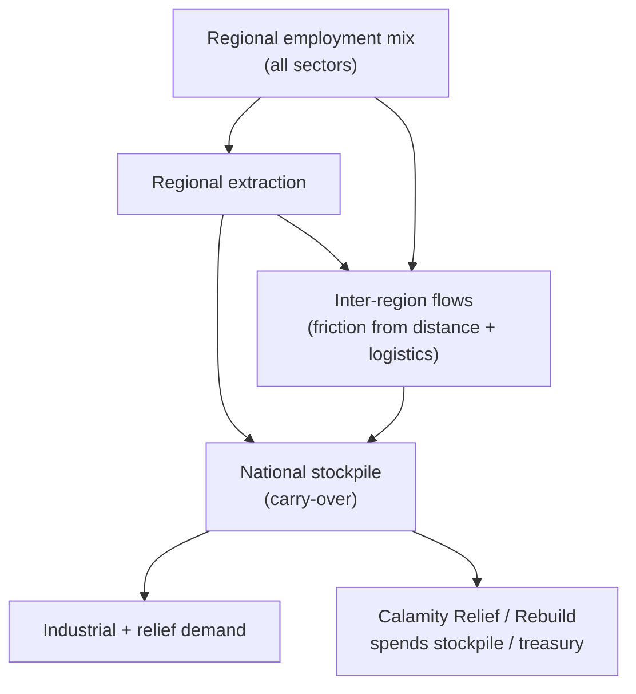
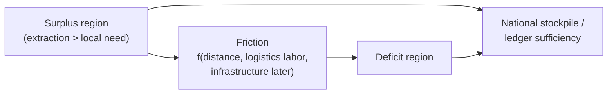

# Stockpiles, domestic flows & regional employment

Sourced design rules for **Phase 0** of the
[nation-management roadmap](../.cursor/plans/nation_management_roadmap_a1b2c3d4.plan.md):
closing documented v1 economy gaps before new nation-management pillars.
Today the national resource ledger compares annual production to demand with
**no carry-over stockpiles** and **no inter-region flows** (see
[resources-and-geography.md](./resources-and-geography.md) §5.2). Extractive
jobs are region-gated; industrial / services / knowledge / command jobs are
not.

> **Implementation note:** Phase 0 (`phase-0a`–`phase-0e`) is implemented in
> `packages/data` (`GameSettings` tunables), `packages/simulation`
> (stockpile ledger, inter-region flows, regional employment capacity,
> calamity weight bias), and `packages/web` (annual cycle wiring, ledger UI,
> calamity spend). Exact magnitudes remain in `GameSettings` and may diverge
> from the research baselines below as the game is balanced.

## Authority

1. Cited public datasets and peer-reviewed models (IEA, FAO/World Bank, gravity
   / economic-geography literature) are the source of truth for *direction*
   and *order-of-magnitude* baselines.
2. `GameSettings` will be the source of truth for in-game curves once Phase 0
   ships — expect numbers to diverge from real-world baselines as the game is
   balanced.
3. Product staging and package ownership remain in the
   [roadmap plan](../.cursor/plans/nation_management_roadmap_a1b2c3d4.plan.md).

---

## 1. National stockpiles (Phase 0c)

### 1.1 Why nations hold stocks

Real states hold **buffer / strategic stocks** of food and energy for three
overlapping reasons that map cleanly onto our calamity + ledger loop:

| Purpose | Real-world analogue | Game channel |
| --- | --- | --- |
| Emergency relief | FAO public food stockholding “emergency stocks”; Strategic Petroleum Reserve (SPR) releases during supply shocks | Calamity Relief / Rebuild spends stockpile to blunt mid-term severity |
| Smooth year-to-year gaps | Buffer stocks against harvest volatility and price spikes | Carry production surplus into deficit years before shortfall penalties apply |
| Collective security obligation | IEA members must hold oil stocks ≥ **90 days of net imports** | Soft target: stockpile depth as days-of-demand coverage for UI and mandates |

**Sources:**

- International Energy Agency — member countries must hold oil stock levels
  equivalent to **no less than 90 days of net imports** and be ready for
  coordinated release during severe disruptions
  ([IEA oil stocks](https://www.iea.org/data-and-statistics/data-tools/oil-stocks-of-iea-countries)).
- U.S. Department of Energy, *Long-Term Strategic Review of the U.S.
  Strategic Petroleum Reserve* (2016) — SPR benefits are framed as **averted
  GDP / import-cost losses** under probabilistic supply-shock scenarios, not
  as a standing price-control tool.
- FAO, *Public food stockholding: objectives, experiences and main issues* —
  distinguishes **emergency stocks** (reduce vulnerability to supply
  disruptions) from **price-stabilization** stocks; warns that programmes
  fail when they chase too many conflicting goals or crowd out private trade.
- World Bank / WFP / FAO strategic grain reserves guidance (2020s) — with
  geopolitics stressing trade, national reserves remain relevant **within
  defined limits and operated on market-compatible principles**.

### 1.2 Design implications for the sim

v1 deliberately excluded stockpiles. Closing the gap should stay **simple**:

| Rule | Research motivation | Suggested v1 mechanic |
| --- | --- | --- |
| Per-resource national stockpile with year carry-over | Emergency + smoothing roles above | One scalar per ledger resource |
| Fill from surplus extraction; draw for industrial demand | Stocks exist to bridge production/demand timing | `stock += max(0, prod − demand)`; shortfalls first eat stock |
| Shortfall only after stock + production cannot cover demand | Extends existing sufficiency ratio | Update ledger math; keep happiness shortfall channel |
| Calamity can destroy a stockpile fraction | Warehouses, ports, and depots are real shock targets | Onset modifier on stock (catalog weight later) |
| Relief / Rebuild can spend stock | FAO emergency-stock purpose; SPR release logic | Spend API hooked in 0a; real costs in 0c / 1b |
| Soft “days of coverage” UI | IEA 90-day heuristic as *feel*, not a hard win condition | `coverageDays = stock / (dailyDemand)` — tunable target band |

**Non-goals (match roadmap):** private market prices between actors; using
stocks as a full commodity exchange; modeling WTO “Amber Box” procurement
rules.

### 1.3 Tunable starting points (not code yet)

These are research-informed **order-of-magnitude** defaults for future
`GameSettings.resources.stockpile` (names illustrative):

| Tunable | Suggested starting band | Rationale |
| --- | --- | --- |
| Target coverage (staples: crops, livestock, fish) | 30–90 days of demand | Below IEA energy rule; food emergency stocks are often thinner than strategic oil |
| Target coverage (energy: fossil fuels) | ~90 days | Direct IEA obligation analogue |
| Target coverage (ores / stone / timber) | 15–45 days | Industrial buffers, not strategic reserves |
| Calamity stockpile loss fraction | 5–25% of regional or national stock | Shock severity scalar; catalog-specific later |
| Spoilage / carrying cost (optional later) | Small annual decay on renewables | Real food stocks spoil; keep off until fiscal Phase 1b if complexity bites |

---

## 2. Inter-region resource flows (Phase 0d)

### 2.1 Gravity intuition

Domestic trade is not free. The workhorse **gravity model** says flows between
regions rise with economic size (supply × demand) and fall with **trade
friction** (distance, transport cost, logistics quality).

**Sources:**

- Tinbergen (1962) and subsequent gravity literature; survey in modern trade
  reviews (e.g. Anderson & van Wincoop structural gravity tradition).
- Donaldson, D. (2015). *The gains from market integration.* Annual Review of
  Economics — gravity as the standard tool for interregional / international
  trade-cost counterfactuals.
- World Bank, *Intra-national Trade Costs in Low and Middle-Income Countries*
  — poor roads, old fleets, and weak logistics raise **within-country** trade
  costs; remote regions are especially isolated; gravity and price-gap
  approaches both used to measure friction.
- Díaz-Lanchas et al. / related work on **generalized transport costs** —
  national (intra-country) trade elasticities are typically **larger** than
  foreign ones: short-haul domestic shipments respond more sharply to cost.

### 2.2 Design implications

Phase 0d stays **domestic only** (no foreign partners until Phase 3a):

| Rule | Research motivation | Suggested mechanic |
| --- | --- | --- |
| Surplus regions supply deficit regions | Gravity: size × complementary demand | Annual rebalancing pass after extraction |
| Friction from hex distance | Distance ≈ ad-valorem trade cost | Cost rises with path length on the island graph |
| Logistics employment reduces friction | World Bank intra-national costs; LPI-style logistics capacity | Transport & logistics sub-sector gets first real mechanic (throughput / friction multiplier) |
| Infrastructure later multiplies capacity | Phase 1a indices | Hook point only in 0d; full multiplier in 1a |
| Optional scarcity / shadow-price UI signal | Price gaps proxy trade costs (Atkin & Donaldson tradition) | UI only — not a full commodity exchange |

**Non-goals:** full CES multi-sector CGE; tariffs on domestic moves; player
micromanaging every shipment.

---

## 3. Per-region non-extractive employment (Phase 0b)

### 3.1 Why jobs cluster

Extractive employment is already biome/overlay-gated. Industrial and service
jobs concentrate for **agglomeration** reasons: firms locate near demand and
each other when transport costs and scale economies interact.

**Sources:**

- Krugman, P. (1991). *Increasing returns and economic geography.* Journal of
  Political Economy, 99(3), 483–499 — manufacturing concentrates into a
  “core” serving a “periphery” when transport costs fall and scale economies
  matter; circular causation between demand location and production location.
- Agglomeration literature reviews (e.g. Upjohn Institute survey) — skilled
  labor pools, upstream/downstream proximity, and **transport infrastructure**
  reinforce concentration; roads connect workers to jobs and firms to
  intermediates.

### 3.2 Design implications

| Rule | Research motivation | Suggested mechanic |
| --- | --- | --- |
| Industrial / services / knowledge / command shares vary by province | Core–periphery + market potential | Capacity from population density, coastal access, and (later) infrastructure |
| Labor edicts move workers within and across regions with limits | Factor mobility is real but sticky | Readable caps; prefer aggregate tallies + sampled citizen updates at 1M pop |
| Map + Population UX show regional job mix | Make agglomeration visible | Overlay / inspector, not only national pies |

**Risk (from roadmap):** storage and assignment cost at 1M citizens — keep
cohort / aggregate patterns from existing employment code
(`packages/simulation/src/employment/`).

---

## 4. Calamity agency hooks (Phase 0a → 0c / 1b)

Phase 0a wires unfinished hooks so later spend is not a retrofit:

| Gap | Research link | Target |
| --- | --- | --- |
| Weekly `emigrationRisk` choice unused | Migration already QoL-modulated ([life-and-demographics.md](./life-and-demographics.md)) | Short emigration modifier on Endure-style weekly picks |
| Relief / Rebuild are scalar-only | Emergency stock + fiscal spend are how real states respond | Document spend API now; stockpile spend in 0c; treasury spend in 1b |
| Catalog bias / cascades (0e) | Over-extraction → fire/flood weights; low QoL → riot weights | World-state weights; social calamities stay debuffs until Phase 2 politics |

---

## 5. What is sourced vs designed

| Element | Status |
| --- | --- |
| Holding stocks for emergencies and smoothing | Sourced (IEA, FAO, SPR literature) |
| ~90-day energy coverage heuristic | Sourced order-of-magnitude (IEA) |
| Gravity / friction intuition for domestic flows | Sourced (trade & World Bank intra-national costs) |
| Agglomeration for non-extractive jobs | Sourced (Krugman / economic geography) |
| Exact days-of-cover targets, loss fractions, friction curves | **Designed** `GameSettings` balance |
| National (not regional) stockpile as v1 shape | **Designed** simplification |
| No private prices in 0c | **Designed** scope cut (roadmap non-goal) |

---

## Where this will live in code (expected)

| Concern | Package |
| --- | --- |
| Stockpile / flow / regional-employment tunables | `packages/data` |
| Annual stockpile, flow, and assignment math | `packages/simulation` (`resources/`, `employment/`) |
| Ledger UI, map employment overlay, calamity spend wiring | `packages/web` |
| Persisted stock + regional job tallies | `packages/persistence` |

Prefer extending existing modules over new top-level concepts until Phase 3
forces a foreign layer.
