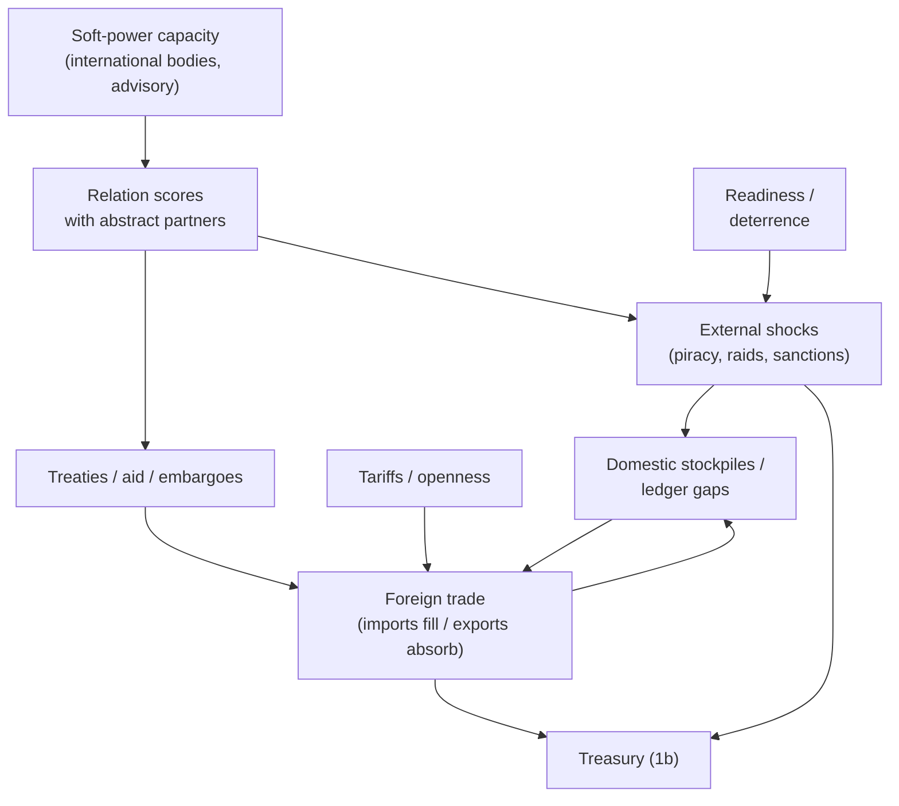

# Trade, diplomacy & defense

Sourced design rules for **Phase 3** of the
[nation-management roadmap](../.cursor/plans/nation_management_roadmap_a1b2c3d4.plan.md):
the optional **external layer** after the island can feed, house, fund, and
police itself. This is the largest scope jump — it introduces actors outside
the island — and should stay abstract at first (not full rival nation sims).

> **Implementation note:** when coding Phase 3 (todos `phase-3a`–`phase-3c`),
> read this document and prefer thin abstract partners over multi-hex wars.
> Domestic channels (treasury, stockpiles, calamity-like shocks, readiness)
> remain the pressure surfaces.

## Authority

1. Trade-openness / growth empirics, UNDP human-development framing of trade,
   Joseph Nye soft power, SIPRI/NATO defense-burden benchmarks, and gravity
   intuition from
   [stockpiles-flows-and-regional-employment.md](./stockpiles-flows-and-regional-employment.md)
   ground *direction*.
2. Magnitudes → `GameSettings` when Phase 3 ships.
3. Roadmap non-goal: player-initiated conquest as the core loop.

---

## 1. Foreign trade (Phase 3a)

### 1.1 Openness and growth (with caveats)

**Sources:**

- Classic cross-country work (e.g. World Bank working-paper tradition on
  openness proxies) — when openness measures are significant, they almost
  always associate **greater openness with higher growth**; results are
  sensitive to period and proxy (tariffs, trade shares, black-market
  premium, etc.).
- Modern bloc / institutional work — tariff cuts help more where
  **regulatory quality / productive capacity** can respond; liberalization
  without capacity can disappoint
  (e.g. comparative integration-bloc studies).
- UNDP *Human Development Impact Assessment* trade toolkit — trade-led GDP
  growth does **not** automatically deliver poverty reduction or HDI gains;
  analyze price, employment, revenue, and capability channels, not tariffs
  alone.
- KOF-style de jure vs de facto globalization — **policy openness** (tariffs,
  NTBs, agreement depth) and **realized flows** (trade/GDP, partner
  diversity) are distinct; both can matter for development outcomes.

### 1.2 Design implications

| Rule | Research motivation | Suggested mechanic |
| --- | --- | --- |
| Abstract trade partners (not full rival sims) | Scope control; gravity still works with aggregate “RoW” | 2–4 partner templates with demand/supply preferences |
| Imports fill ledger gaps; exports absorb surplus stockpiles | Trade as buffer + vent for surplus | Connect to Phase 0c stockpiles and 1b treasury |
| Tariffs / openness levers | De jure policy channel | Higher tariffs → revenue + domestic protection vs partner relations hit |
| Mercantilist systems bias defaults | Existing economic-system fantasy | Default openness priors, player-overridable |
| Light social/environmental externalities on some imports | HDIA “multiple channels” caution | Small QoL/env modifiers — not a full LCA model |
| Trade balance feeds treasury | Customs + export earnings stylized | Net trade cashflow line item |

**Non-goals initially:** full GTAP/CGE; player designing every HS-6 tariff
line; modeling shipping seasons in real time.

---

## 2. Diplomacy / foreign relations (Phase 3b)

### 2.1 Soft power vs hard power

**Sources:**

- Nye, J.S. — **soft power** is the ability to affect others to obtain
  preferred outcomes through **attraction and co-option** rather than
  coercion or payment; resources include culture, political values, and
  foreign policies (behavior ≠ resource)
  ([concept evolution essay](https://www.softpowerclub.org/wp-content/uploads/2021/03/Nye-Soft-power-the-evolution-of-a-concept-1.pdf)).
- Hard power = coercion (military) or inducement (payments/sanctions).
  Sanctions are economic but still **hard** in Nye’s behavioral sense —
  useful for modeling embargo events without calling them “soft.”
- Domestic quinary flavor already names **international bodies** and
  **strategic advisory** ([economic-sectors.md](../packages/web/public/economic-sectors.md))
  — natural soft-power capacity inputs.

### 2.2 Design implications

| Rule | Research motivation | Suggested mechanic |
| --- | --- | --- |
| Relation scores with abstract partners | Continuous affinity, not binary peace/war | −100..+100 or 0–100 scales |
| Treaties unlock trade tiers or aid | Institutional depth (de jure openness) | Relation gates on trade capacity |
| Sanctions / embargo events as calamity-like external shocks | Hard-power economic tools | Reuse calamity pipeline patterns |
| `international-bodies` / Strategic Advisory labor → soft-power capacity | Nye attraction channel | Capacity raises relation gains / treaty success odds |

**Non-goals:** full multi-agent diplomatic AI with hidden agendas every tick;
UN voting blocs as a second game.

---

## 3. Defense / military readiness (Phase 3c)

### 3.1 Defense burden benchmarks

**Sources:**

- NATO defence investment pledges — long-running political benchmark of
  **≥ 2% of GDP** on defence (Wales 2014; reaffirmed Vilnius 2023); 2025
  Hague summit language moves Allies toward a much higher combined
  **5% of GDP by 2035** investment commitment (core defence +
  defence-and-security-related spending). Use **2%** as the familiar
  readiness heuristic for a small island kingdom; treat 5% as an upper
  crisis/militarization band, not a peacetime default.
- SIPRI military-expenditure tradition — tracks military spending levels and
  **military burden** (spending/GDP) as the comparable cross-country
  intensity measure.
- Roadmap product choice: defense is **protective/reactive** so the game
  stays a nation sim, not a war game.

### 3.2 Design implications

| Rule | Research motivation | Suggested mechanic |
| --- | --- | --- |
| Readiness from budget + relevant labor | Burden + force generation stylized | Readiness 0–100 |
| Feudal Knight-style roles as morale/readiness flavor | Existing role catalog | Role multipliers, not a separate combat sim |
| Deterrence reduces piracy/raid-style external shocks | Hard power as prevention | Shock rate/severity ↓ with readiness |
| Neglect raises external shock weights | Under-funded forces invite predation | Inverse of above |
| Marshal aide proposals gain real readiness effects | Wire existing aide channel | Replace pure flavor with readiness deltas |

**Non-goals initially:** player-initiated conquest; multi-hex battlefield
combat; arms-race minigame as the main loop.

---

## 4. Integration with earlier phases

| Phase 3 piece | Depends on | Feeds |
| --- | --- | --- |
| 3a Trade | 0c stockpiles, 1b treasury, ideally 0d logistics | Treasury, sufficiency, light ext. |
| 3b Diplomacy | 3a trade tiers; quinary staffing | Treaties, embargo shocks |
| 3c Defense | 1b military budget line; roles | Shock deterrence; Marshal aides |

Exit criteria (roadmap): the island participates in a wider world **without
abandoning** the domestic QoL / extraction / calamity loop.

---

## 5. What is sourced vs designed

| Element | Status |
| --- | --- |
| Openness tends to associate with growth when institutions allow | Sourced (trade–growth literature) |
| Trade ≠ automatic human development | Sourced (UNDP HDIA) |
| Soft vs hard power distinction; sanctions as hard | Sourced (Nye) |
| ~2% GDP defense heuristic; higher crisis bands | Sourced order-of-magnitude (NATO) |
| Abstract partners; no conquest victory | **Designed** (roadmap) |
| Exact tariff elasticities and shock tables | **Designed** |

---

## Where this will live in code (expected)

| Concern | Package |
| --- | --- |
| Partner templates, tariff bands, readiness tunables | `packages/data` |
| Trade / relations / readiness ticks | `packages/simulation` (new `foreign/` only when forced) |
| Foreign desk panel | `packages/web` |
| Persisted relations + readiness | `packages/persistence` |
